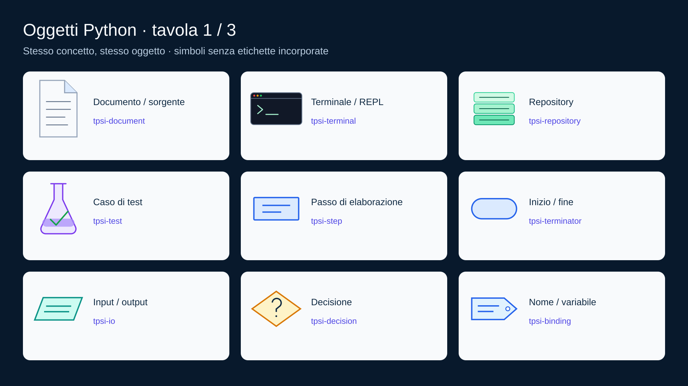
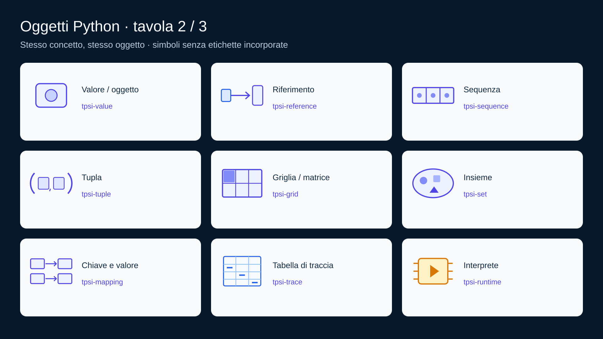
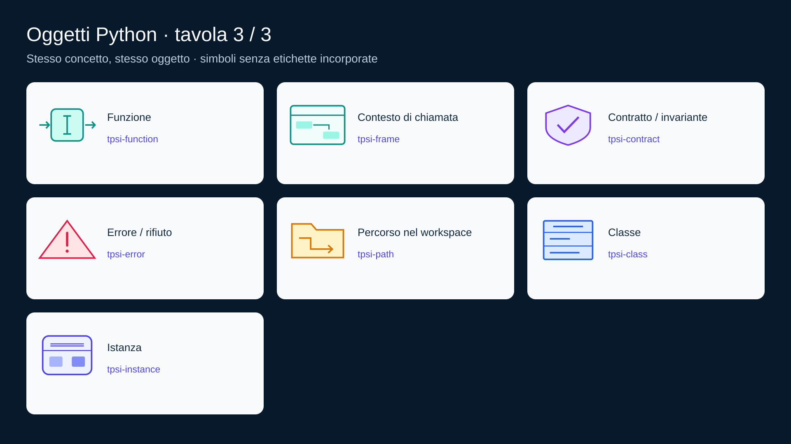
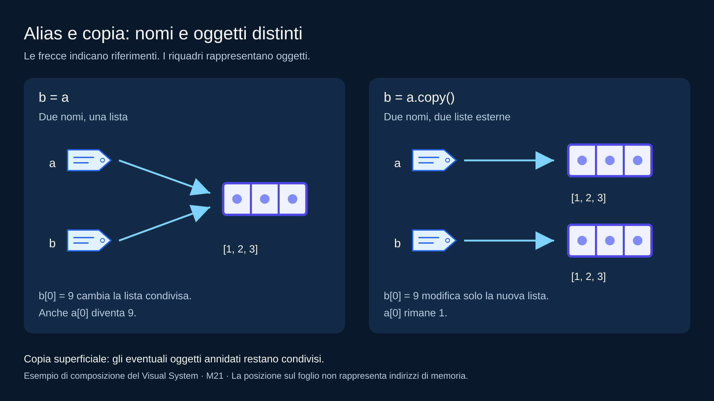

# Python — Visual System

Collezione vettoriale di 25 oggetti per comporre le immagini del corso: quattro oggetti comuni ripresi da TPSI quarto e 21 originali per algoritmi e Python. I simboli non contengono etichette: la scena assegna significato, nomi, valori e relazioni. La libreria è pronta al riuso; le figure delle lezioni sono pianificate nell'<a href="../../../doc/VISUAL_AUDIT.md">audit</a>.

## Cataloghi

## File e responsabilità

<ul>
<li><a href="components.svg">components.svg</a>: forme sorgente e identificatori stabili <code>tpsi-*</code>, mantenuti per compatibilità con il generatore TPSI.</li>
<li><a href="tokens.json">tokens.json</a>: palette, font locale, dimensioni e griglia.</li>
<li><a href="component-inventory.json">Inventario</a>: nome e origine di ogni oggetto.</li>
<li><a href="scenes/">Scene sorgente</a>: posizioni, etichette, relazioni e destinazione <code>data-output</code>.</li>
<li><a href="figure-index.json">Registro delle figure</a>: backlog distinto dagli asset realizzati e dall'inserimento nelle lezioni.</li>
<li><a href="../../../scripts/build_course_diagrams.py">Generatore</a>: incorpora i simboli e risolve i token; produce SVG autonomi e controlla riferimenti, ID e destinazioni.</li>
</ul>

## Regole grafiche

Canvas 1920 × 1080, griglia di 8 px, margine sicuro 64 px. Fondo blu scuro, pannelli chiari o blu, contorni arrotondati per gli oggetti; le forme dei flow chart mantengono il significato canonico. Font Arial con fallback sans-serif, titolo 48 px, etichette 28–32 px, identificatori del catalogo 23 px. I simboli sono ingrandibili senza perdita di qualità.

<table align="center">
<thead><tr><th>Colore</th><th>Significato nel corso Python</th></tr></thead>
<tbody>
<tr><td>Blu</td><td>Passi, nomi, descrizioni e controllo</td></tr>
<tr><td>Turchese</td><td>Input/output, funzioni e contesti di chiamata</td></tr>
<tr><td>Indaco</td><td>Valori, strutture dati, istanze e riferimenti</td></tr>
<tr><td>Ambra</td><td>Decisione, interprete, percorso e attenzione</td></tr>
<tr><td>Viola</td><td>Test, contratti e invarianti</td></tr>
<tr><td>Rosso</td><td>Errore o transizione rifiutata</td></tr>
</tbody>
</table>

Il colore accompagna sempre un'etichetta. I nomi tecnici dei token comuni, come <code>process</code> e <code>thread</code>, provengono dalla quarta e identificano colori: nel corso Python non introducono concorrenza. Freccia continua: flusso o riferimento, specificato dalla legenda; linea senza punta: associazione; tratteggio: relazione indiretta dichiarata. Non mescolare significati nella stessa figura senza una legenda esplicita.

Una sequenza può rappresentare una stringa o una lista solo con etichetta chiara e indicazione della mutabilità. Il simbolo tupla non implica che gli oggetti contenuti siano tutti immutabili. Il percorso non è il contenuto del file, la classe non è l'istanza, la copia superficiale non è una duplicazione ricorsiva.

## Esempio di composizione

<em>Scena dimostrativa per M21; non ancora inserita nella lezione.</em>

## Costruire e verificare

<ol>
<li>Scegliere la relazione dall'audit e gli oggetti dai cataloghi.</li>
<li>Creare una scena con titolo, descrizione, <code>role="img"</code>, canvas canonico e <code>&lt;defs id="visual-kit-components"/&gt;</code>.</li>
<li>Usare <code>&lt;use href="#tpsi-sequence" x="…" y="…" width="…" height="…"/&gt;</code> e token come <code>{{data}}</code>; aggiungere nomi, valori e legenda nella scena.</li>
<li>Generare, controllare visivamente frecce e testi e verificare l'esempio contro la lezione.</li>
<li>Solo dopo la costruzione, aggiornare alt, didascalia e stato del registro e inserire l'immagine nella dispensa.</li>
</ol>

<pre lang="bash"><code>python scripts/build_course_diagrams.py
python scripts/build_course_diagrams.py --check
python scripts/build_visual_audit.py --check
python tests/course_presentation.py</code></pre>

## Provenienza

Architettura e grammatica derivate dai Visual System di <a href="https://github.com/TheBitPoets/tpsi-quinto-docente/tree/main/assets/tpsi5/visual-system">TPSI quinto</a> e <a href="https://github.com/TheBitPoets/tpsi-quarto-docente/tree/main/assets/tpsi4/visual-system">TPSI quarto</a>, consultati il 16 settembre 2026. Documento, terminale, repository e test sono ripresi dalla libreria della quarta, che ne registra l'origine nella quinta. I restanti 21 simboli e le scene Python sono originali. La palette mantiene la continuità visiva; nessun logo ufficiale o asset remoto è necessario alla visualizzazione.

