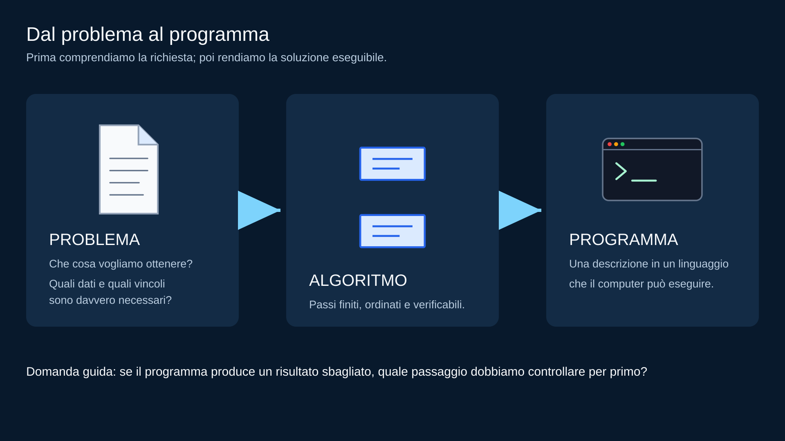
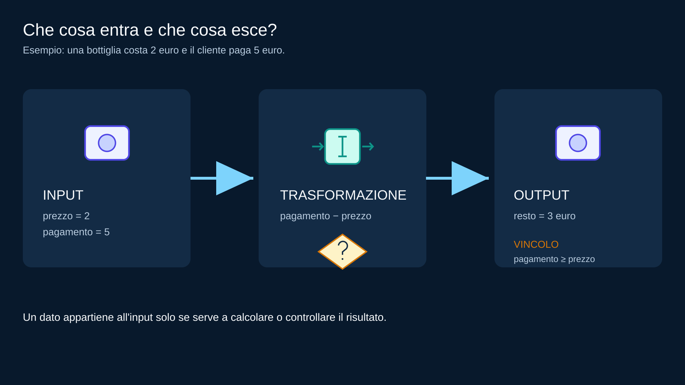
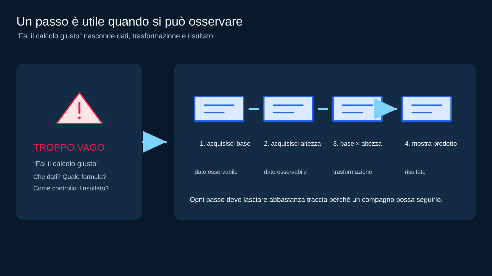
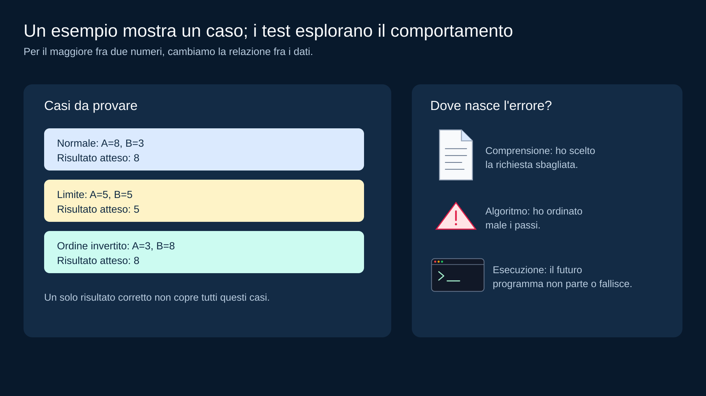

# M00 — Problema, algoritmo, programma, input e output

<!-- COURSE-FRAME:START -->
<table align="center">
<tr><td>

&#129517; <strong>Orientamento della sezione</strong>

<strong>&#128506; Contesto:</strong>
Il percorso comincia dalla distinzione fra problema, algoritmo e programma, prima di usare un linguaggio.

<strong>&#128736; Prerequisiti:</strong>
Nessuna esperienza di programmazione: bastano la lettura di una consegna e semplici calcoli.

<strong>&#127919; Obiettivi:</strong>
distinguere un <strong>problema</strong> da un <strong>algoritmo</strong> e da un <strong>programma</strong>; individuare input, output e vincoli in una consegna semplice; riconoscere informazioni necessarie, inutili o mancanti; <a href="#obiettivi">Tutti gli obiettivi del modulo</a>.

<strong>&#128257; Richiamo:</strong>
Parti da una procedura quotidiana e chiediti quali dati servono e quale risultato deve produrre.

<strong>&#128064; Anticipazione:</strong>
Il percorso prosegue con <a href="01_DAL_PROBLEMA_AI_PASSI.md">M01 — Dal problema ai passi: specifica, pseudocodice e trace</a>. Una consegna diventa una sequenza di passi verificabile con una traccia manuale.

<strong>&#10145; Prossimo passo:</strong>
Analizza il problema del resto: indica input, output, vincolo e un caso che non rispetta il vincolo.

<strong>&#128279; Rimando:</strong>
<a href="../../student/README.md">Indice del percorso studente</a>; <a href="#obiettivi">obiettivi della lezione</a>.

</td></tr>
</table>
<!-- COURSE-FRAME:END -->

<blockquote>

<strong>Stato:</strong> draft / orientamento iniziale 
<strong>Collocazione:</strong> prima settimana, integrato nella finestra PY2-01 
<strong>Dipendenze:</strong> nessuna; Python e Flowchart Lab non sono prerequisiti

</blockquote>

## Obiettivi

Alla fine di questo modulo dovresti saper:

<ul>
  <li>distinguere un <strong>problema</strong> da un <strong>algoritmo</strong> e da un <strong>programma</strong>;</li>
  <li>individuare input, output e vincoli in una consegna semplice;</li>
  <li>riconoscere informazioni necessarie, inutili o mancanti;</li>
  <li>descrivere una soluzione come una sequenza finita di passi;</li>
  <li>usare esempi e controesempi per controllare se hai capito il problema;</li>
  <li>distinguere almeno intuitivamente un errore di comprensione, un errore nell'algoritmo e un errore di esecuzione.</li>
</ul>

Non devi ancora scrivere codice.

---

## 1. Prima del linguaggio viene il problema

Considera la richiesta:

<blockquote>

Una bottiglia costa 2 euro. Un cliente paga con 5 euro. Quanto resto deve ricevere?

</blockquote>

La domanda non chiede ancora Python, un flow chart o una formula da memorizzare. Chiede di capire una situazione: quali dati conosciamo, quale risultato serve e quale condizione deve essere rispettata perché il risultato abbia senso.

<em>Il programma arriva dopo aver chiarito la richiesta e ordinato i passi.</em>

Nel nostro esempio, il prezzo e il pagamento sono i dati di ingresso. Il resto è il risultato che vogliamo comunicare. Il pagamento deve essere almeno uguale al prezzo: se il cliente paga meno, la consegna non descrive più un normale calcolo del resto e dobbiamo decidere come gestire quel caso.

Una possibile procedura legge i due dati, calcola la differenza e comunica il risultato. Questa procedura è un piccolo <strong>algoritmo</strong>: non è ancora scritto in Python, ma è già abbastanza preciso da poter essere seguito e controllato da un'altra persona.

---

## 2. Problema, algoritmo, programma

## Problema

È ciò che vogliamo risolvere. Una richiesta come “calcola il resto” sembra semplice, ma diventa realmente utilizzabile solo quando sappiamo quale prezzo e quale pagamento considerare e che cosa fare se il pagamento non è sufficiente.

## Algoritmo

È una procedura abbastanza precisa da poter essere seguita passo-passo. “Precisa” non significa lunga: significa che ogni passo fornisce le informazioni necessarie a svolgere quello successivo e che il risultato può essere controllato con un esempio.

Per i nostri primi problemi deve essere:

<ul>
  <li>finita;</li>
  <li>non ambigua al livello necessario;</li>
  <li>eseguibile con i dati disponibili;</li>
  <li>verificabile con esempi concreti.</li>
</ul>

## Programma

È una descrizione dell'algoritmo in un linguaggio che il computer può eseguire. Un programma può essere scritto senza errori di sintassi e produrre comunque il risultato sbagliato se l'algoritmo o la comprensione della richiesta erano sbagliati.

<em>La stessa idea viene resa progressivamente più precisa: problema, algoritmo, programma.</em>

Nel corso useremo spesso questa sequenza: capire la richiesta, estrarre i dati, progettare i passi, rappresentarli, scrivere il programma, provarlo e correggerlo. Il programma è quindi una parte del percorso: non sostituisce il ragionamento che viene prima.

---

## 3. Input, output e vincoli

Restiamo nella situazione della bottiglia: per descrivere bene il problema dobbiamo separare i dati che entrano, l'operazione che li trasforma e il risultato che deve uscire.

<blockquote>

Una bottiglia costa 2 euro. Un cliente paga con 5 euro. Quanto resto deve ricevere?

</blockquote>

Gli input sono il prezzo della bottiglia e il pagamento ricevuto. La trasformazione consiste nel calcolare la differenza tra pagamento e prezzo; l'output è il resto da consegnare. C'è anche un vincolo: il pagamento deve essere maggiore o uguale al prezzo. Se il cliente paga meno, non possiamo chiamare la differenza “resto” senza prima decidere come segnalare il pagamento insufficiente.

<em>Input, trasformazione, output e vincolo rispondono a domande diverse.</em>

## Informazioni inutili

Se la consegna aggiunge:

<blockquote>

Il sensore è di colore blu.

</blockquote>

il colore probabilmente non serve a calcolare il resto.

Un buon programmatore non usa automaticamente ogni dato disponibile: chiede <strong>quale dato serve davvero alla decisione</strong>.

---

## 4. Informazioni mancanti

Consegna:

<blockquote>

Calcola l'area.

</blockquote>

Possiamo farlo?

Non ancora: manca almeno la forma e mancano le misure necessarie.

Una specifica insufficiente non si corregge inventando dati.

Prima si chiarisce il problema.

---

## 5. I passi devono essere operativi

Confronta una frase vaga come “fai il calcolo giusto e mostra il risultato” con una sequenza che dichiara esplicitamente i dati, la trasformazione e l'output.

<em>Un algoritmo leggibile rende visibili dati, trasformazione e risultato.</em>

La seconda versione è più utile perché rende espliciti dati e trasformazione. Un compagno può controllare se abbiamo letto davvero base e altezza, se abbiamo usato la formula corretta e se il risultato è stato mostrato nel momento giusto.

Non significa che ogni algoritmo debba avere molti passi: significa che i passi essenziali non devono essere nascosti dietro parole vaghe.

---

## 6. Un esempio non dimostra tutto

Supponiamo di avere un algoritmo che dovrebbe restituire il maggiore tra due numeri.

Con il caso A = 8 e B = 3 l'algoritmo restituisce 8. È un primo controllo, ma non è sufficiente per dire che la soluzione funziona sempre: abbiamo visto soltanto una disposizione dei dati.

Per esplorare meglio il comportamento proviamo almeno un caso con l'ordine invertito, un caso in cui i valori sono uguali e un caso con valori negativi. Ogni prova pone una domanda: la soluzione tratta entrambi gli ordini? Sa che il maggiore può essere uguale a entrambi? Confronta correttamente anche numeri sotto zero?

<em>Un esempio riuscito è un'evidenza su un caso, non una dimostrazione generale.</em>

Nel secondo anno costruire casi di test diventerà una normale abitudine di lavoro.

---

## 7. Caso normale, caso limite, controesempio

## Caso normale

Rappresenta una situazione comune.

Esempio: età 15 in una verifica <code>età &gt;= 14</code>.

## Caso limite

È vicino a un confine importante.

Esempi: 13 e 14 per la soglia 14. Il primo sta appena sotto il confine; il secondo è esattamente sul confine. Possiamo aggiungere 15 per osservare il lato opposto. Il caso limite non è “un caso strano”: è un caso scelto perché una piccola differenza può cambiare il risultato.

## Controesempio

È un dato che mostra che la nostra soluzione non funziona come pensavamo.

Cercare controesempi non significa voler “rompere” il lavoro di qualcuno: significa verificarlo seriamente.

---

## 8. Error Clinic: tre errori diversi

## Ho capito male il problema

La specifica chiede la media, ma io progetto la somma.

Il programma potrebbe essere eseguito perfettamente e restare comunque sbagliato.

## L'algoritmo è sbagliato

Ho capito la richiesta, ma ho ordinato male i passi o dimenticato un caso.

## L'esecuzione fallisce

L'algoritmo può essere corretto, ma un futuro programma può contenere un errore di sintassi, un dato non valido o un altro problema di esecuzione.

<em>Prima di correggere, identifica quale livello del ragionamento è in errore.</em>

Questa distinzione ci aiuterà a fare debug senza cambiare cose a caso. Se abbiamo scelto la richiesta sbagliata, modificare una formula non risolve il problema; se l'algoritmo è corretto ma l'esecuzione fallisce, dobbiamo invece cercare il difetto nella traduzione in programma.

---

## 9. Micro-lab senza computer

Per ciascuna consegna annota, in questo ordine, quali dati entrano, quale risultato deve uscire, quali vincoli devono essere rispettati, quali passi proponi e almeno un caso normale e uno vicino a un confine. Non serve usare parole tecniche perfette: serve lasciare una traccia che un compagno possa seguire senza chiederti che cosa intendevi.

<table align="center">
<thead><tr><th>Domanda</th><th>Esempio sul resto</th></tr></thead>
<tbody>
<tr><td>Quali dati entrano?</td><td>Prezzo e pagamento.</td></tr>
<tr><td>Che cosa deve uscire?</td><td>Il resto, se il pagamento è sufficiente.</td></tr>
<tr><td>Quale vincolo vale?</td><td>Pagamento maggiore o uguale al prezzo.</td></tr>
<tr><td>Come controllo l'idea?</td><td>Provo pagamento uguale, maggiore e insufficiente.</td></tr>
</tbody>
</table>

Le proposte da analizzare sono:

<ol>
  <li>calcolare il resto;</li>
  <li>decidere se una temperatura supera una soglia;</li>
  <li>trovare il maggiore tra due valori;</li>
  <li>descrivere un percorso di tre mosse su una griglia.</li>
</ol>

Poi scambia il foglio con un compagno. Il compagno deve poter ricostruire la tua idea e indicare dove manca un dato, un controllo o un passo. Se deve interromperti spesso per chiedere spiegazioni, non è un problema del compagno: è un segnale che la specifica o l'algoritmo sono ancora troppo vaghi.

---

## 10. Diagnostic iniziale

Il diagnostic non è una verifica con voto.

Serve a capire da dove parte la classe.

Domande possibili:

<ul>
  <li>quali dati servono?;</li>
  <li>quale risultato è richiesto?;</li>
  <li>quale passo manca?;</li>
  <li>questo procedimento termina?;</li>
  <li>quale esempio proveresti per primo?</li>
</ul>

Non serve conoscere parole tecniche perfette: conta il ragionamento.

---

## Minimum mastery checkpoint

Prima di proseguire dovresti riuscire a:

<ol>
  <li>spiegare con parole tue problema/algoritmo/programma;</li>
  <li>estrarre input e output da una consegna breve;</li>
  <li>segnalare un'informazione mancante;</li>
  <li>ordinare una sequenza semplice di passi;</li>
  <li>proporre almeno due casi diversi;</li>
  <li>dire perché un solo esempio non garantisce che la soluzione sia corretta.</li>
</ol>

## Recap

<em>Capire prima, rappresentare poi, eseguire e controllare infine.</em>

Prima di scrivere codice, chiediti: ho capito la richiesta? Ho separato dati, risultato e vincoli? I passi sono osservabili? Ho scelto almeno due casi diversi? Se una risposta è “non ancora”, torna al modello del problema e correggilo. Prossimo modulo: trasformiamo il problema in pseudocodice e impariamo a fare un trace manuale sistematico.

