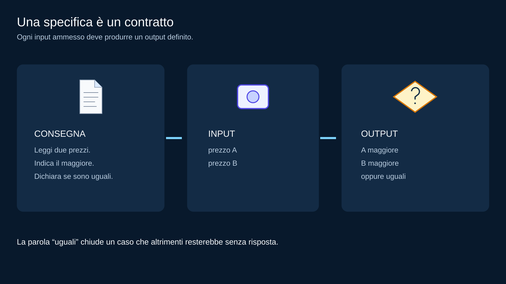
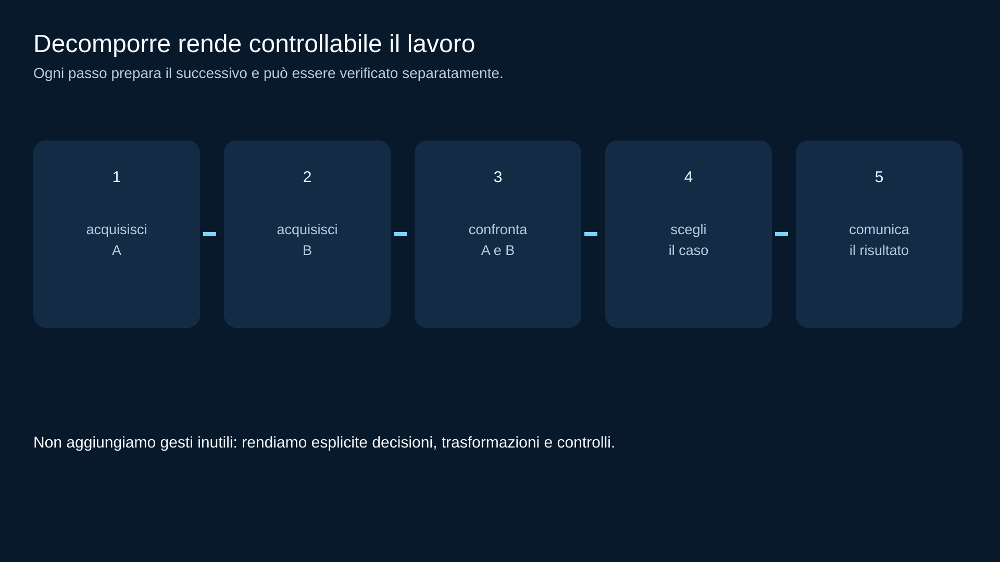
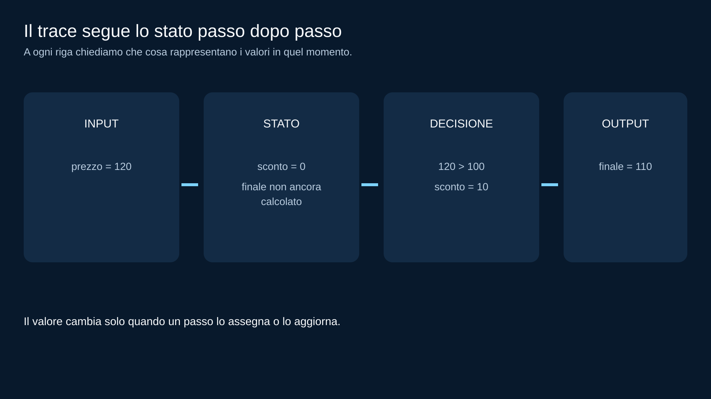
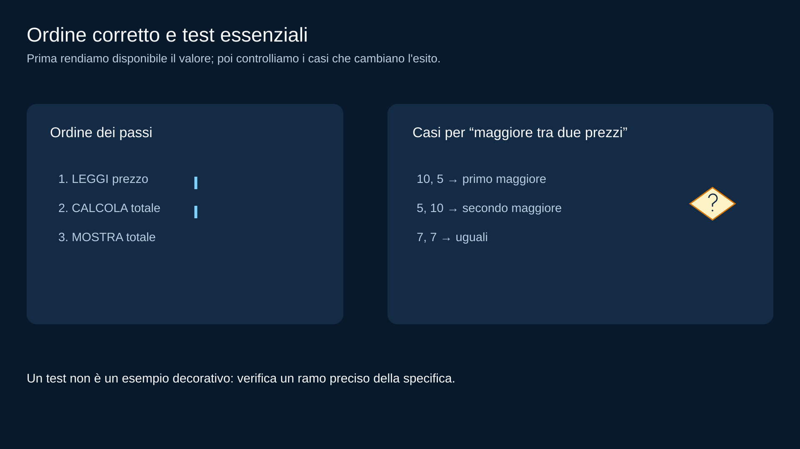

# M01 — Dal problema ai passi: specifica, pseudocodice e trace

<!-- COURSE-FRAME:START -->
<table align="center">
<tr><td>
<details>
<summary>&#129517; <strong>Orientamento della sezione</strong></summary>

<p align="justify">
<strong><span style="font-size: 1.15em;">&#128506;</span> Contesto:</strong>
Una consegna diventa una sequenza di passi verificabile con una traccia manuale.
</p>

<p align="justify">
<strong><span style="font-size: 1.15em;">&#128736;</span> Prerequisiti:</strong>
Distinguere input, output e vincoli come in M00; Python non è richiesto.
</p>

<p align="justify">
<strong><span style="font-size: 1.15em;">&#127919;</span> Obiettivi:</strong>
leggere una specifica breve e separare dati, risultato e vincoli;<br>decomporre un problema in passi piccoli e controllabili;<br>riconoscere un algoritmo ambiguo, incompleto o non terminante; <a href="#obiettivi">Tutti gli obiettivi del modulo</a>.
</p>

<p align="justify">
<strong><span style="font-size: 1.15em;">&#128257;</span> Richiamo:</strong>
Riprendi il resto e separa i dati iniziali dai valori calcolati durante la procedura. Riprendi <a href="00_PROBLEMA_ALGORITMO_INPUT_OUTPUT.md">M00 — Problema, algoritmo, programma, input e output</a>.
</p>

<p align="justify">
<strong><span style="font-size: 1.15em;">&#128064;</span> Anticipazione:</strong>
Il percorso prosegue con <a href="02_FLOWCHART_SEQUENZA_SELEZIONE.md">M02 — Flow chart: sequenza, input/output e selezione</a>. I passi e le decisioni diventano un diagramma di flusso leggibile anche senza computer.
</p>

<p align="justify">
<strong><span style="font-size: 1.15em;">&#10145;</span> Prossimo passo:</strong>
Scrivi lo pseudocodice del resto ed eseguilo su carta, annotando ogni cambiamento di stato.
</p>

<p align="justify">
<strong><span style="font-size: 1.15em;">&#128279;</span> Rimando:</strong>
<a href="../../student/README.md">Indice del percorso studente</a>; <a href="#obiettivi">obiettivi della lezione</a>.
</p>

</details>
</td></tr>
</table>
<!-- COURSE-FRAME:END -->

<blockquote>
<p align="justify"><strong>Stato:</strong> draft<br>
<strong>UDA:</strong> PY2-01 — Problem solving, algoritmi e flow chart<br>
<strong>Prerequisiti:</strong> M00; nessun linguaggio di programmazione richiesto</p>
</blockquote>

## Obiettivi

<p align="justify">Alla fine di questo modulo dovresti saper:</p>

<ul>
  <li>leggere una specifica breve e separare dati, risultato e vincoli;</li>
  <li>decomporre un problema in passi piccoli e controllabili;</li>
  <li>riconoscere un algoritmo ambiguo, incompleto o non terminante;</li>
  <li>scrivere pseudocodice semplice senza mascherarlo da Python;</li>
  <li>eseguire un dry-run manuale;</li>
  <li>annotare come cambia lo stato durante l'esecuzione;</li>
  <li>scegliere casi normali, casi limite e controesempi.</li>
</ul>

---

## 1. Una specifica è un contratto da capire

<p align="justify">Problema:</p>

<blockquote>
<p align="justify">Leggi due prezzi e indica quale dei due è maggiore. Se sono uguali, dichiaralo.</p>
</blockquote>

<p align="justify">Prima di pensare alla soluzione estraiamo i dati e il risultato atteso. La consegna &egrave; completa solo se prevede anche il caso in cui i prezzi siano uguali.</p>

<p align="center"></p>
<p align="center"><em>Una specifica definisce quali dati entrano e quale risposta deve uscire per ogni caso.</em></p>

<p align="justify">La parola <strong>uguali</strong> è importante: senza quel caso una soluzione apparentemente corretta potrebbe essere incompleta.</p>

<p align="justify">Domanda guida:</p>

<blockquote>
<p align="justify">Che cosa deve essere vero dell'output per ogni input ammesso?</p>
</blockquote>

---

## 2. Decomporre non significa complicare

<p align="justify">Una soluzione utile pu&ograve; essere divisa in passi abbastanza piccoli da poter essere controllati, senza descrivere ogni gesto irrilevante.</p>

<p align="center"></p>
<p align="center"><em>La decomposizione rende visibili le decisioni e i punti che potremo verificare.</em></p>

<p align="justify">Non serve spezzare ogni gesto in decine di micro-passaggi.</p>

<p align="justify">La decomposizione serve a rendere visibili:</p>

<ul>
  <li>decisioni;</li>
  <li>trasformazioni dei dati;</li>
  <li>punti in cui potrebbe mancare un caso;</li>
  <li>parti che potremo verificare separatamente.</li>
</ul>

---

## 3. Ambiguo per chi?

<p align="justify">Considera:</p>

```text
1. prendi due numeri
2. scegli quello giusto
3. stampa
```

<p align="justify">Per l'autore può sembrare chiaro, ma <strong>“quello giusto”</strong> non definisce una regola eseguibile.</p>

<p align="justify">Un algoritmo deve comunicare la decisione, non solo l'intenzione.</p>

<p align="justify">Versione migliore:</p>

```text
se A > B
    risultato ← A
altrimenti se B > A
    risultato ← B
altrimenti
    risultato ← "uguali"
```

<p align="justify">Qui la freccia <code>←</code> significa “assegna/aggiorna il valore concettuale”, non è sintassi Python.</p>

---

## 4. Pseudocodice: scrivere per persone

<p align="justify">Lo pseudocodice non ha un unico standard universale per il nostro corso.</p>

<p align="justify">Usiamo convenzioni semplici e coerenti:</p>

```text
LEGGI dato
ASSEGNA nome ← espressione
SE condizione
    ...
ALTRIMENTI
    ...
FINE SE
MOSTRA valore
```

<p align="justify">Più avanti useremo anche:</p>

```text
MENTRE condizione
    ...
FINE MENTRE
```

<p align="justify">Lo scopo è esprimere l'algoritmo senza essere bloccati dalla sintassi di un linguaggio.</p>

---

## 5. Non scrivere “Python travestito” troppo presto

<p align="justify">Se ancora non conosci Python, questo:</p>

```text
if x >= 10:
    print(x)
```

<p align="justify">non è davvero pseudocodice neutro: introduce già regole di un linguaggio specifico.</p>

<p align="justify">Per ora preferiamo:</p>

```text
SE x >= 10
    MOSTRA x
FINE SE
```

<p align="justify">Quando arriverà Python, collegheremo idee già comprese a una sintassi concreta.</p>

---

## 6. Dry-run: eseguire con carta e penna

<p align="justify">Algoritmo:</p>

```text
LEGGI prezzo
ASSEGNA sconto ← 0
SE prezzo > 100
    ASSEGNA sconto ← 10
FINE SE
ASSEGNA finale ← prezzo - sconto
MOSTRA finale
```

<p align="justify">Proviamo <code>prezzo = 120</code>.</p>

<table align="center">
<thead>
<tr>
<th>passo</th>
<th>prezzo</th>
<th>sconto</th>
<th>finale</th>
<th>output</th>
</tr>
</thead>
<tbody>
<tr>
<td>iniziale</td>
<td>120</td>
<td>—</td>
<td>—</td>
<td>—</td>
</tr>
<tr>
<td>sconto iniziale</td>
<td>120</td>
<td>0</td>
<td>—</td>
<td>—</td>
</tr>
<tr>
<td>decisione</td>
<td>120</td>
<td>10</td>
<td>—</td>
<td>—</td>
</tr>
<tr>
<td>calcolo</td>
<td>120</td>
<td>10</td>
<td>110</td>
<td>—</td>
</tr>
<tr>
<td>output</td>
<td>120</td>
<td>10</td>
<td>110</td>
<td>110</td>
</tr>
</tbody>
</table>

<p align="justify">Il trace rende visibile lo <strong>stato</strong> dell'algoritmo.</p>

---

## 7. Lo stato cambia nel tempo

<p align="justify">Una variabile concettuale non è soltanto un'etichetta su un foglio.</p>

<p align="justify">Durante il trace pu&ograve; cambiare. Per esempio, il prezzo 120 parte senza sconto, riceve lo sconto quando la condizione &egrave; vera e produce il valore finale 110.</p>

<p align="center"></p>
<p align="center"><em>Lo stato &egrave; l'insieme dei valori disponibili in un determinato momento dell'esecuzione.</em></p>

<p align="justify">Per capire un algoritmo chiediti spesso:</p>

<blockquote>
<p align="justify">Che cosa rappresenta questo valore <strong>dopo</strong> il passo appena eseguito?</p>
</blockquote>

<p align="justify">Questa domanda tornerà nei cicli, nei contatori e negli accumulatori.</p>

---

## 8. Ordine dei passi

<p align="justify">Un algoritmo &egrave; sbagliato se prova a mostrare un valore prima di averlo calcolato. L'ordine corretto e i casi di test sono illustrati qui:</p>

<p align="center"></p>
<p align="center"><em>Prima si determina il dato, poi lo si comunica; i test controllano i rami della specifica.</em></p>

<p align="justify">Il debug non richiede sempre di riscrivere tutto: cerca la <strong>modifica minima che ripristina il contratto</strong>.</p>

---

## 9. Finitezza e terminazione

<p align="justify">Procedura:</p>

```text
ripeti "prova ancora"
```

<p align="justify">Quando finisce?</p>

<p align="justify">Non è dichiarato.</p>

<p align="justify">Una procedura automatica deve avere una regola di terminazione o un numero finito di passi.</p>

<p align="justify">In M03 studieremo i cicli e impareremo a cercare esplicitamente:</p>

```text
inizializzazione
condizione
aggiornamento
uscita
```

---

## 10. Test prima del programma

<p align="justify">Per il problema &ldquo;maggiore tra due prezzi&rdquo; scegliamo i tre casi che cambiano l'esito: il primo prezzo maggiore, il secondo prezzo maggiore e i prezzi uguali. Se la specifica ammette anche zero o valori negativi, aggiungiamo almeno un esempio per verificare quei vincoli.</p>

<p align="justify">Non dobbiamo aspettare di avere un programma per progettare test utili.</p>

---

## 11. Error Clinic

## Passaggio mancante

<p align="justify">Calcolo una media senza aver contato quanti valori ci sono.</p>

## Stato senza significato

<p align="justify">Uso <code>totale</code>, ma non so spiegare che cosa rappresenta in un certo punto.</p>

## Caso non coperto

<p align="justify">Gestisco A &gt; B e B &gt; A, ma non A = B.</p>

## Procedura non terminante

<p align="justify">Ripeto un passo senza una condizione di uscita.</p>

<p align="justify">Per ogni errore prova a rispondere:</p>

<ol>
  <li>qual è il contratto violato?;</li>
  <li>qual è il primo passo in cui il trace diverge?;</li>
  <li>qual è la modifica minima?.</li>
</ol>

---

## 12. Laboratorio: dal testo all'algoritmo

<p align="justify">Scegli uno dei problemi:</p>

<ul>
  <li>tariffa base + supplemento sopra una soglia;</li>
  <li>maggiore tra due valori;</li>
  <li>temperatura dentro/fuori intervallo;</li>
  <li>tre mosse di un robot su griglia.</li>
</ul>

<p align="justify">Consegna:</p>

```text
INPUT
OUTPUT
VINCOLI
PSEUDOCODICE
2 casi normali/alternativi
1 caso limite
TRACE di almeno un caso
```

<p align="justify">Il compagno che riceve il tuo lavoro deve poter simulare l'algoritmo senza chiederti spiegazioni aggiuntive.</p>

---

## Minimum mastery checkpoint

<p align="justify">Dovresti saper:</p>

<ol>
  <li>estrarre input/output/vincoli;</li>
  <li>trasformare una consegna in passi ordinati;</li>
  <li>usare pseudocodice leggibile e non dipendente da Python;</li>
  <li>fare un trace con almeno una variabile che cambia;</li>
  <li>riconoscere un caso non coperto;</li>
  <li>spiegare perché un algoritmo finisce;</li>
  <li>proporre test prima della codifica.</li>
</ol>

## Recap

```text
specifica
→ decomposizione
→ pseudocodice
→ trace
→ casi di test
```

<p align="justify">Prossimo modulo: rappresentiamo sequenze e decisioni con diagrammi di flusso.</p>
