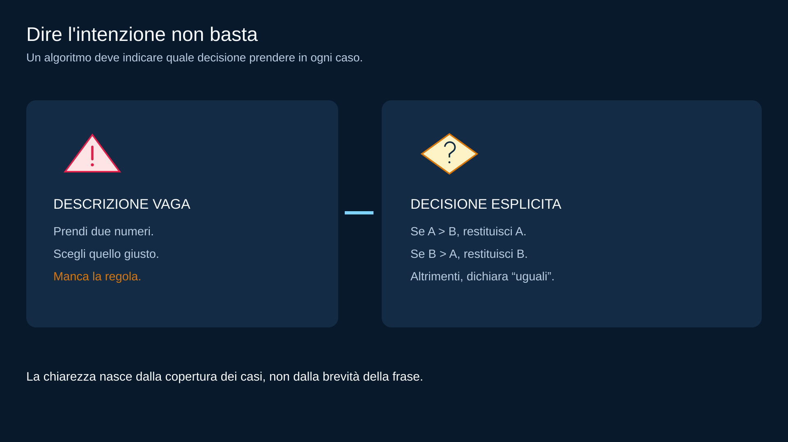

# M01 — Dal problema ai passi: specifica, pseudocodice e trace

<!-- COURSE-FRAME:START -->
<table align="center">
<tr><td>
<details>
<summary>&#129517; <strong>Orientamento della sezione</strong></summary>

<p align="justify">
<strong><span style="font-size: 1.15em;">&#128506;</span> Contesto:</strong>
Una consegna diventa una sequenza di passi verificabile con una traccia manuale.
</p>

<p align="justify">
<strong><span style="font-size: 1.15em;">&#128736;</span> Prerequisiti:</strong>
Distinguere input, output e vincoli come in M00; Python non è richiesto.
</p>

<p align="justify">
<strong><span style="font-size: 1.15em;">&#127919;</span> Obiettivi:</strong>
leggere una specifica breve e separare dati, risultato e vincoli;<br>decomporre un problema in passi piccoli e controllabili;<br>riconoscere un algoritmo ambiguo, incompleto o non terminante; <a href="#obiettivi">Tutti gli obiettivi del modulo</a>.
</p>

<p align="justify">
<strong><span style="font-size: 1.15em;">&#128257;</span> Richiamo:</strong>
Riprendi il resto e separa i dati iniziali dai valori calcolati durante la procedura. Riprendi <a href="00_PROBLEMA_ALGORITMO_INPUT_OUTPUT.md">M00 — Problema, algoritmo, programma, input e output</a>.
</p>

<p align="justify">
<strong><span style="font-size: 1.15em;">&#128064;</span> Anticipazione:</strong>
Il percorso prosegue con <a href="02_FLOWCHART_SEQUENZA_SELEZIONE.md">M02 — Flow chart: sequenza, input/output e selezione</a>. I passi e le decisioni diventano un diagramma di flusso leggibile anche senza computer.
</p>

<p align="justify">
<strong><span style="font-size: 1.15em;">&#10145;</span> Prossimo passo:</strong>
Scrivi lo pseudocodice del resto ed eseguilo su carta, annotando ogni cambiamento di stato.
</p>

<p align="justify">
<strong><span style="font-size: 1.15em;">&#128279;</span> Rimando:</strong>
<a href="../../student/README.md">Indice del percorso studente</a>; <a href="#obiettivi">obiettivi della lezione</a>.
</p>

</details>
</td></tr>
</table>
<!-- COURSE-FRAME:END -->

<blockquote>
<p align="justify"><strong>Stato:</strong> draft<br>
<strong>UDA:</strong> PY2-01 — Problem solving, algoritmi e flow chart<br>
<strong>Prerequisiti:</strong> M00; nessun linguaggio di programmazione richiesto</p>
</blockquote>

## Obiettivi

<p align="justify">Alla fine di questo modulo dovresti saper:</p>

<ul>
  <li>leggere una specifica breve e separare dati, risultato e vincoli;</li>
  <li>decomporre un problema in passi piccoli e controllabili;</li>
  <li>riconoscere un algoritmo ambiguo, incompleto o non terminante;</li>
  <li>scrivere pseudocodice semplice senza mascherarlo da Python;</li>
  <li>eseguire un dry-run manuale;</li>
  <li>annotare come cambia lo stato durante l'esecuzione;</li>
  <li>scegliere casi normali, casi limite e controesempi.</li>
</ul>

---

## 1. Una specifica è un contratto da capire

<table align="center">
<tr>
<td>
<p align="justify">
<strong><span style="font-size: 1.15em;">&#128214;</span> Definizione — specifica:</strong>
Una specifica descrive quali dati riceve una procedura, quale risultato deve produrre e quali vincoli deve rispettare per ogni input ammesso.
</p>
</td>
</tr>
</table>

<p align="justify">Problema:</p>

<blockquote>
<p align="justify">Leggi due prezzi e indica quale dei due è maggiore. Se sono uguali, dichiaralo.</p>
</blockquote>

<p align="justify">Prima di pensare alla soluzione estraiamo i dati e il risultato atteso. La consegna &egrave; completa solo se prevede anche il caso in cui i prezzi siano uguali.</p>

<p align="center"></p>
<p align="center"><em>Una specifica definisce quali dati entrano e quale risposta deve uscire per ogni caso.</em></p>

<p align="justify">La parola <strong>uguali</strong> è importante: senza quel caso una soluzione apparentemente corretta potrebbe essere incompleta.</p>

<p align="justify">Domanda guida:</p>

<blockquote>
<p align="justify">Che cosa deve essere vero dell'output per ogni input ammesso?</p>
</blockquote>


<p align="justify"><strong>Passaggio:</strong> La specifica ci dice che cosa deve uscire; adesso la scomponiamo in passi ordinati, abbastanza piccoli da poter essere controllati.</p>

---

## 2. Decomporre non significa complicare

<table align="center">
<tr>
<td>
<p align="justify">
<strong><span style="font-size: 1.15em;">&#128214;</span> Definizione — decomposizione:</strong>
La decomposizione consiste nel dividere un problema in passi o sotto-problemi più piccoli, ciascuno con uno scopo riconoscibile e controllabile.
</p>
</td>
</tr>
</table>

<p align="justify">Una soluzione utile pu&ograve; essere divisa in passi abbastanza piccoli da poter essere controllati, senza descrivere ogni gesto irrilevante.</p>

<p align="center"></p>
<p align="center"><em>La decomposizione rende visibili le decisioni e i punti che potremo verificare.</em></p>

<p align="justify">Non serve spezzare ogni gesto in decine di micro-passaggi.</p>

<p align="justify">La decomposizione serve a rendere visibili:</p>

<ul>
  <li>decisioni;</li>
  <li>trasformazioni dei dati;</li>
  <li>punti in cui potrebbe mancare un caso;</li>
  <li>parti che potremo verificare separatamente.</li>
</ul>


<p align="justify"><strong>Passaggio:</strong> Una sequenza di passi &egrave; utile solo se ogni istruzione ha lo stesso significato per chi la scrive e per chi la esegue.</p>

---

## 3. Ambiguo per chi?

<p align="justify">Considera una descrizione volutamente vaga: dice di scegliere &ldquo;quello giusto&rdquo;, ma non spiega come riconoscerlo.</p>

<p align="center"></p>
<p align="center"><em>La figura rende visibile la differenza tra intenzione e regola eseguibile.</em></p>

<p align="justify">Per l'autore può sembrare chiaro, ma <strong>“quello giusto”</strong> non definisce una regola eseguibile.</p>

<p align="justify">Un algoritmo deve comunicare la decisione, non solo l'intenzione.</p>

<p align="justify">La versione esplicita assegna un risultato a ciascuna relazione possibile tra A e B: maggiore il primo, maggiore il secondo oppure uguali. In questo modo un'altra persona pu&ograve; eseguire la procedura senza dover indovinare la regola.</p>

<p align="justify">Quando scriviamo che un risultato viene assegnato o aggiornato, descriviamo un cambiamento dello stato concettuale. La notazione aiuta a ragionare sull'algoritmo; la sintassi Python verr&agrave; introdotta in seguito.</p>


<p align="justify"><strong>Passaggio:</strong> Dopo aver reso esplicite le decisioni, scegliamo una notazione leggibile che descriva l'idea senza legarla ancora a Python.</p>

---

## 4. Pseudocodice: scrivere per persone

<table align="center">
<tr>
<td>
<p align="justify">
<strong><span style="font-size: 1.15em;">&#128214;</span> Definizione — pseudocodice:</strong>
Lo pseudocodice è una descrizione testuale dei passi di un algoritmo, scritta per essere letta dalle persone. Usa convenzioni coerenti senza richiedere la sintassi completa di un linguaggio di programmazione; non ha un unico standard universale.
</p>
</td>
</tr>
</table>

<table align="center">
<tr>
<td>
<p align="justify">
<strong><span style="font-size: 1.15em;">&#128214;</span> Definizione — operatore:</strong>
Un <strong>operatore</strong> indica un'operazione da eseguire su uno o più valori. Nel nostro pseudocodice usiamo già i simboli aritmetici e di confronto che ritroveremo in Python.
</p>
</td>
</tr>
</table>

<table align="center">
<tr>
<td>
<p align="justify">
<strong><span style="font-size: 1.15em;">&#128214;</span> Definizione — espressione:</strong>
Un'espressione è un singolo valore, un nome a cui è associato un valore oppure una combinazione di valori, nomi e operatori che, quando viene valutata, produce un valore. Valutare un'espressione significa determinarne il risultato usando i valori disponibili in quel momento.
</p>
</td>
</tr>
</table>

<p align="justify">Sono espressioni <code>5</code>, <code>prezzo</code>, <code>prezzo + 3</code> e <code>prezzo &gt; 100</code>. Se <code>prezzo</code> vale 120, producono rispettivamente 5, 120, 123 e vero. Un'espressione può quindi produrre anche una risposta vero/falso. <code>ASSEGNA totale &larr; prezzo + 3</code> è invece un'istruzione che usa il risultato di un'espressione per aggiornare una variabile.</p>

### Operatori aritmetici

<table align="center">
<tr>
<td>
<p align="justify">
<strong><span style="font-size: 1.15em;">&#128214;</span> Definizione — operatori aritmetici:</strong>
Gli <strong>operatori aritmetici</strong> permettono di calcolare un nuovo valore numerico. Un'espressione come <code>prezzo + 3</code> indica un calcolo; per conservarne il risultato useremo un assegnamento.
</p>
</td>
</tr>
</table>

<table align="center">
<thead><tr><th>Operatore</th><th>Significato</th><th>Esempio</th><th>Risultato</th></tr></thead>
<tbody>
<tr><td><code>+</code></td><td>addizione</td><td><code>7 + 2</code></td><td>9</td></tr>
<tr><td><code>-</code></td><td>sottrazione</td><td><code>7 - 2</code></td><td>5</td></tr>
<tr><td><code>*</code></td><td>moltiplicazione</td><td><code>7 * 2</code></td><td>14</td></tr>
<tr><td><code>/</code></td><td>divisione</td><td><code>7 / 2</code></td><td>3.5</td></tr>
<tr><td><code>//</code></td><td>divisione intera</td><td><code>7 // 2</code></td><td>3</td></tr>
<tr><td><code>%</code></td><td>resto della divisione intera</td><td><code>7 % 2</code></td><td>1</td></tr>
</tbody>
</table>

<p align="justify">Usiamo <code>*</code> per la moltiplicazione e il punto per i decimali: <code>3.5</code> significa tre e mezzo. Per <code>/</code>, <code>//</code> e <code>%</code> il divisore deve essere diverso da zero.</p>

### Divisione intera e resto: formare gruppi

<table align="center">
<tr>
<td>
<p align="justify">
<strong><span style="font-size: 1.15em;">&#128214;</span> Definizione — divisione intera e resto:</strong>
Per introdurre <code>//</code> e <code>%</code> lavoriamo con una <strong>quantità intera non negativa</strong> e una <strong>dimensione del gruppo intera positiva</strong>. In questi casi <code>//</code> conta quanti gruppi completi possiamo formare e <code>%</code> conta quanti elementi avanzano. Il comportamento con numeri negativi sarà approfondito in <a href="05_ESPRESSIONI_OPERATORI_PRIME_FUNZIONI.md">M05</a>.
</p>
</td>
</tr>
</table>

<p align="justify"><strong>Esempio:</strong> con 17 oggetti e scatole da 3, <code>17 // 3</code> produce 5 scatole complete e <code>17 % 3</code> produce 2 oggetti avanzati. Possiamo controllare il risultato ricomponendo il totale: <code>5 * 3 + 2</code> produce proprio 17. Il simbolo <code>%</code> indica il resto, non il calcolo di una percentuale.</p>

<table align="center">
<thead><tr><th>Oggetti</th><th>Posti per scatola</th><th>Scatole complete con //</th><th>Oggetti avanzati con %</th></tr></thead>
<tbody>
<tr><td>17</td><td>3</td><td>5</td><td>2</td></tr>
<tr><td>18</td><td>3</td><td>6</td><td>0</td></tr>
<tr><td>2</td><td>3</td><td>0</td><td>2</td></tr>
<tr><td>0</td><td>3</td><td>0</td><td>0</td></tr>
</tbody>
</table>

### Parentesi e ordine delle operazioni

<p align="justify">Un'espressione può contenere più operazioni. Per gli operatori aritmetici appena introdotti seguiamo questo ordine:</p>

<ol>
  <li>calcoliamo prima le espressioni fra <strong>parentesi</strong>, partendo da quelle più interne;</li>
  <li>eseguiamo <code>*</code>, <code>/</code>, <code>//</code> e <code>%</code>, che hanno la stessa priorità, da sinistra verso destra;</li>
  <li>eseguiamo <code>+</code> e <code>-</code>, che hanno la stessa priorità, da sinistra verso destra.</li>
</ol>

<p align="justify"><strong>Esempio:</strong> <code>2 + 3 * 4</code> produce 14, perché prima calcoliamo <code>3 * 4</code>. Invece <code>(2 + 3) * 4</code> produce 20. A parità di priorità conta l'ordine da sinistra: <code>12 / 3 * 2</code> produce 8, mentre <code>12 / (3 * 2)</code> produce 2.</p>

<p align="justify">Le parentesi aiutano anche a rendere visibile la regola del problema: per la media di due valori scriviamo <code>(A + B) / 2</code>, perché dobbiamo sommare entrambi prima di dividere.</p>

### Operatori di confronto

<table align="center">
<tr>
<td>
<p align="justify">
<strong><span style="font-size: 1.15em;">&#128214;</span> Definizione — operatori di confronto:</strong>
Gli <strong>operatori di confronto</strong> confrontano due valori e producono una risposta <strong>vera o falsa</strong>. Questa risposta permette a una selezione di scegliere il percorso da eseguire.
</p>
</td>
</tr>
</table>

<p align="justify">Nel nostro pseudocodice usiamo già gli stessi simboli di confronto che ritroveremo in Python:</p>

<table align="center">
<thead><tr><th>Operatore</th><th>Significato</th><th>Esempio vero</th><th>Esempio falso</th></tr></thead>
<tbody>
<tr><td><code>==</code></td><td>uguale a</td><td><code>5 == 5</code></td><td><code>5 == 3</code></td></tr>
<tr><td><code>!=</code></td><td>diverso da</td><td><code>5 != 3</code></td><td><code>5 != 5</code></td></tr>
<tr><td><code>&lt;</code></td><td>minore di</td><td><code>3 &lt; 5</code></td><td><code>5 &lt; 5</code></td></tr>
<tr><td><code>&lt;=</code></td><td>minore o uguale a</td><td><code>5 &lt;= 5</code></td><td><code>6 &lt;= 5</code></td></tr>
<tr><td><code>&gt;</code></td><td>maggiore di</td><td><code>5 &gt; 3</code></td><td><code>5 &gt; 5</code></td></tr>
<tr><td><code>&gt;=</code></td><td>maggiore o uguale a</td><td><code>5 &gt;= 5</code></td><td><code>3 &gt;= 5</code></td></tr>
</tbody>
</table>

<p align="justify">La differenza fra <code>&gt;</code> e <code>&gt;=</code>, oppure fra <code>&lt;</code> e <code>&lt;=</code>, riguarda il valore di confine: <code>eta &gt;= 14</code> è vera anche quando l'età è proprio 14, mentre <code>eta &gt; 14</code> è falsa.</p>

<p align="justify">Possiamo verificare l'uguaglianza anche fra testi: <code>comando == "N"</code> chiede se il valore letto è il testo <code>"N"</code>. È vero quando il comando è N e falso quando è S. Le virgolette delimitano il testo da confrontare; <code>comando</code> è invece il nome della variabile che contiene il dato letto.</p>

<table align="center">
<tr>
<td>
<p align="justify">
<strong><span style="font-size: 1.15em;">&#128214;</span> Definizione — assegnamento:</strong>
Un assegnamento crea o aggiorna il valore associato a una variabile. Nel nostro pseudocodice usiamo <code>&larr;</code> per assegnare e <code>==</code> per confrontare l'uguaglianza. In Python l'assegnamento si scriverà con <code>=</code>, mentre il confronto resterà <code>==</code>.
</p>
</td>
</tr>
</table>

<p align="justify"><strong>Confrontare e assegnare sono operazioni diverse:</strong> <code>ASSEGNA quantita &larr; 5</code> memorizza 5 nella variabile; <code>quantita == 5</code> controlla il valore senza modificarlo. Se la quantità contiene 3, il confronto è falso e la quantità resta 3.</p>

<p align="justify">Nell'assegnamento calcoliamo prima l'espressione a destra della freccia, poi memorizziamo il risultato nella variabile a sinistra. Per esempio, se <code>quantita</code> contiene 5, <code>ASSEGNA quantita &larr; quantita + 1</code> calcola 6 usando il valore precedente e poi aggiorna la variabile a 6.</p>

### Convenzioni per le istruzioni

<p align="justify">Usiamo convenzioni semplici e coerenti. La tabella seguente è la nostra sintassi di riferimento:</p>

<table align="center">
<thead>
<tr><th>Idea</th><th>Forma</th><th>Che cosa significa</th><th>Esempio</th></tr>
</thead>
<tbody>
<tr><td><strong>Input</strong></td><td><pre><code>LEGGI &lt;nome_variabile&gt;</code></pre></td><td>ricevi un dato e conservalo in una variabile</td><td><pre><code>LEGGI prezzo</code></pre></td></tr>
<tr><td><strong>Output</strong></td><td><pre><code>MOSTRA &lt;nome_variabile&gt;</code></pre></td><td>comunica il valore o il messaggio richiesto</td><td><pre><code>MOSTRA finale</code></pre></td></tr>
<tr><td><strong>Assegnamento</strong></td><td><pre><code>ASSEGNA &lt;nome_variabile&gt; &larr; &lt;valore&gt;</code></pre></td><td>crea o aggiorna un valore durante la procedura</td><td><pre><code>ASSEGNA totale &larr; prezzo + 3</code></pre></td></tr>
<tr><td><strong>Selezione</strong></td><td><pre><code>SE &lt;condizione&gt;
    ...
ALTRIMENTI
    ...
FINE SE</code></pre></td><td>scegli un percorso in base a una condizione</td><td><pre><code>SE prezzo &gt; 100
    ASSEGNA sconto &larr; 10
ALTRIMENTI
    ASSEGNA sconto &larr; 0
FINE SE</code></pre></td></tr>
<tr><td><strong>Selezione a più casi</strong></td><td><pre><code>SE &lt;condizione_1&gt;
    ...
ALTRIMENTI SE &lt;condizione_2&gt;
    ...
ALTRIMENTI
    ...
FINE SE</code></pre></td><td>scegli il primo caso con condizione vera; se nessuna è vera, esegui il caso finale</td><td><pre><code>SE A &gt; B
    MOSTRA A
ALTRIMENTI SE B &gt; A
    MOSTRA B
ALTRIMENTI
    MOSTRA "uguali"
FINE SE</code></pre></td></tr>
<tr><td><strong>Ciclo</strong></td><td><pre><code>MENTRE &lt;condizione&gt;
    ...
FINE MENTRE</code></pre></td><td>ripeti i passi finch? la condizione resta vera</td><td><pre><code>MENTRE tentativi &lt; 3
    ASSEGNA tentativi &larr; tentativi + 1
FINE MENTRE</code></pre></td></tr>
</tbody>
</table>

<p align="justify">Le parole tra parentesi angolari sono segnaposto: <code>&lt;nome_variabile&gt;</code> indica che dobbiamo sostituirle con un nome concreto, come <code>prezzo</code> o <code>totale</code>. I tre puntini rappresentano i passi che appartengono a quel blocco.</p>

<p align="justify">Lo scopo è esprimere l'algoritmo senza essere bloccati dalla sintassi di un linguaggio.</p>

### 4.1 Selezione a più casi: ALTRIMENTI SE

<table align="center">
<tr>
<td>
<p align="justify">
<strong><span style="font-size: 1.15em;">&#128214;</span> Definizione — condizione e selezione:</strong>
Una <strong>condizione</strong> è un'affermazione che può essere vera o falsa, come <code>A &gt; B</code>. Con <code>SE ... ALTRIMENTI</code> scegliamo fra due percorsi. Quando i casi possibili sono più di due, possiamo aggiungere uno o più rami <code>ALTRIMENTI SE &lt;condizione&gt;</code>.
</p>
</td>
</tr>
</table>

<p align="justify">Le condizioni vengono controllate dall'alto verso il basso: si esegue <strong>solo il ramo della prima condizione vera</strong>, poi si prosegue dopo <code>FINE SE</code>. Il ramo finale <code>ALTRIMENTI</code> non ha una condizione: raccoglie tutti i casi in cui le condizioni precedenti sono false. Si possono ripetere più rami <code>ALTRIMENTI SE</code> prima dell'eventuale <code>ALTRIMENTI</code>.</p>

<p align="justify">Nell'esempio della tabella, con A pari a 8 e B pari a 3 il primo confronto è vero e mostriamo A; con A pari a 3 e B pari a 8 il primo è falso, il secondo è vero e mostriamo B; con A e B entrambi pari a 5 i due confronti sono falsi e mostriamo &ldquo;uguali&rdquo;. Abbiamo quindi <strong>due condizioni e tre casi</strong>.</p>

<p align="justify">L'ordine conta anche quando più condizioni potrebbero essere vere: se controlliamo prima <code>punteggio &gt;= 90</code> e poi <code>punteggio &gt;= 60</code>, un punteggio di 95 entra solo nel primo ramo. Con due <code>SE</code> separati, invece, entrambi i blocchi potrebbero essere eseguiti.</p>

<p align="justify">Il ramo <code>ALTRIMENTI</code> è facoltativo anche nella selezione semplice: se manca e la condizione è falsa, non eseguiamo il blocco e proseguiamo dopo <code>FINE SE</code>.</p>

### 4.2 Combinare condizioni: E, O, NON

<table align="center">
<tr>
<td>
<p align="justify">
<strong><span style="font-size: 1.15em;">&#128214;</span> Definizione — operatori booleani:</strong>
A volte una decisione dipende da più condizioni insieme. Gli <strong>operatori booleani</strong>, detti anche operatori logici, permettono di combinarle o negarle e producono ancora un risultato vero o falso. Nel nostro pseudocodice usiamo <code>E</code>, <code>O</code> e <code>NON</code>; i nomi inglesi corrispondenti sono <code>AND</code>, <code>OR</code> e <code>NOT</code>.
</p>
</td>
</tr>
</table>

<table align="center">
<thead><tr><th>Operatore</th><th>Quando il risultato è vero</th><th>Esempio</th></tr></thead>
<tbody>
<tr><td><strong>E (AND)</strong></td><td>quando entrambe le condizioni sono vere</td><td><code>(quantita &gt;= 1) E (quantita &lt;= 10)</code>: la quantità è compresa tra 1 e 10, estremi inclusi</td></tr>
<tr><td><strong>O (OR)</strong></td><td>quando almeno una delle condizioni è vera, anche se lo sono entrambe</td><td><code>(prezzo &gt;= 100) O (quantita &gt;= 10)</code>: basta raggiungere almeno una delle due soglie</td></tr>
<tr><td><strong>NON (NOT)</strong></td><td>quando la condizione negata è falsa; se era vera, diventa falsa</td><td><code>NON (quantita &gt; 0)</code>: la quantità è zero o negativa</td></tr>
</tbody>
</table>

<p align="justify"><strong>Esempio con E:</strong> accettiamo un ordine solo se la quantità è compresa tra 1 e 10, estremi inclusi. I due confronti formano un'unica condizione composta.</p>

```text
LEGGI quantita
SE (quantita >= 1) E (quantita <= 10)
    MOSTRA "quantità ammessa"
ALTRIMENTI
    MOSTRA "quantità non ammessa"
FINE SE
```

<table align="center">
<thead><tr><th>quantita</th><th>quantita &gt;= 1</th><th>quantita &lt;= 10</th><th>Risultato con E</th><th>Output</th></tr></thead>
<tbody>
<tr><td>0</td><td>falso</td><td>vero</td><td>falso</td><td>quantità non ammessa</td></tr>
<tr><td>1</td><td>vero</td><td>vero</td><td>vero</td><td>quantità ammessa</td></tr>
<tr><td>5</td><td>vero</td><td>vero</td><td>vero</td><td>quantità ammessa</td></tr>
<tr><td>10</td><td>vero</td><td>vero</td><td>vero</td><td>quantità ammessa</td></tr>
<tr><td>11</td><td>vero</td><td>falso</td><td>falso</td><td>quantità non ammessa</td></tr>
</tbody>
</table>

<p align="justify"><strong>Esempio con O:</strong> uno sconto spetta se <code>(prezzo &gt;= 100) O (quantita &gt;= 10)</code>. Con prezzo 120 e quantità 2 la condizione è vera grazie al prezzo; con prezzo 80 e quantità 10 è vera grazie alla quantità; con prezzo 120 e quantità 10 è ancora vera, perché OR comprende anche il caso in cui entrambe le condizioni sono vere. Con prezzo 80 e quantità 2 è falsa.</p>

<p align="justify"><strong>Esempio con NON:</strong> <code>NON (quantita &gt; 0)</code> è vera con quantità 0, perché il confronto <code>0 &gt; 0</code> è falso; è falsa con quantità 5, perché <code>5 &gt; 0</code> è vero. Possiamo negare anche una condizione composta: <code>NON ((quantita &gt;= 1) E (quantita &lt;= 10))</code> riconosce le quantità fuori dall'intervallo, come 0 e 11. In questo caso equivale a <code>(quantita &lt; 1) O (quantita &gt; 10)</code>.</p>

<p align="justify">Usiamo le <strong>parentesi</strong> per rendere espliciti i gruppi di condizioni e, con <code>NON</code>, che cosa stiamo negando. Ogni confronto deve essere completo: scriviamo <code>(quantita &gt;= 1) E (quantita &lt;= 10)</code>, ripetendo il dato da confrontare.</p>

<p align="justify">Quando combiniamo calcoli e condizioni, eseguiamo prima i calcoli aritmetici, poi i confronti, infine gli operatori logici nell'ordine <code>NON</code>, <code>E</code>, <code>O</code>. Le parentesi permettono di scegliere esplicitamente i gruppi: <code>NON ((quantita &gt;= 1) E (quantita &lt;= 10))</code> nega il risultato dell'intera combinazione con <code>E</code>.</p>

### Esempio: riconoscere un numero pari o dispari

<table align="center">
<tr>
<td>
<p align="justify">
<strong><span style="font-size: 1.15em;">&#128214;</span> Definizione — numero pari:</strong>
Il resto permette anche di riconoscere se un numero è pari: un intero è <strong>pari</strong> quando la divisione per 2 ha resto zero. Usiamo come input un intero non negativo e combiniamo il calcolo del resto con un confronto:
</p>
</td>
</tr>
</table>

```text
LEGGI numero
SE (numero % 2) == 0
    MOSTRA "pari"
ALTRIMENTI
    MOSTRA "dispari"
FINE SE
```

<p align="justify">Con 8, il resto <code>8 % 2</code> è 0: il confronto <code>0 == 0</code> è vero e mostriamo &ldquo;pari&rdquo;. Con 7, il resto è 1: <code>1 == 0</code> è falso e mostriamo &ldquo;dispari&rdquo;. Anche 0 è pari, perché <code>0 % 2</code> produce 0.</p>

---

## 5. Non scrivere “Python travestito” troppo presto

<p align="justify">Se ancora non conosci Python, questo:</p>

```text
if x >= 10:
    print(x)
```

<p align="justify">non è davvero pseudocodice neutro: introduce già regole di un linguaggio specifico.</p>

<p align="justify">Per ora preferiamo:</p>

```text
SE x >= 10
    MOSTRA x
FINE SE
```

<p align="justify">Quando arriverà Python, collegheremo idee già comprese a una sintassi concreta.</p>


<p align="justify"><strong>Passaggio:</strong> La procedura &egrave; stata scritta: il passo seguente &egrave; interpretarla come farebbe una macchina, annotando ogni cambiamento prima di pensare al codice.</p>

---

## 6. Dry-run: eseguire con carta e penna

<table align="center">
<tr>
<td>
<p align="justify">
<strong><span style="font-size: 1.15em;">&#128214;</span> Definizione — dry-run o trace manuale:</strong>
Un dry-run è l'esecuzione a mano dei passi di un algoritmo su dati scelti. Il trace è la traccia in cui annotiamo i passi eseguiti, i valori delle variabili e gli output prodotti.
</p>
</td>
</tr>
</table>

<p align="justify">Prima di eseguire una traccia manuale costruiamo l'algoritmo partendo da una consegna concreta:</p>

<blockquote>
<p align="justify">Un negozio applica uno sconto di 10 euro quando il prezzo supera 100 euro. Calcola il prezzo finale.</p>
</blockquote>

<p align="justify">Applichiamo il metodo visto in M00 e nei paragrafi precedenti:</p>

<ol>
  <li><strong>Input:</strong> il prezzo iniziale.</li>
  <li><strong>Output:</strong> il prezzo finale da comunicare.</li>
  <li><strong>Regola:</strong> lo sconto vale solo quando il prezzo è maggiore di 100; in tutti gli altri casi lo sconto è zero.</li>
  <li><strong>Passi:</strong> leggiamo il prezzo, inizializziamo lo sconto, verifichiamo la condizione, calcoliamo il finale e mostriamo il risultato.</li>
</ol>

<p align="justify">La sequenza dei passi è già un algoritmo: il pseudocodice seguente la rende abbastanza precisa da poter essere eseguita a mano. Solo dopo averlo scritto scegliamo un valore di prova e registriamo come cambia lo stato.</p>

```text
LEGGI prezzo
ASSEGNA sconto ← 0
SE prezzo > 100
    ASSEGNA sconto ← 10
FINE SE
ASSEGNA finale ← prezzo - sconto
MOSTRA finale
```

<p align="justify">Proviamo con un <code>prezzo</code> pari a 120.</p>

<table align="center">
<thead>
<tr>
<th>passo</th>
<th>prezzo</th>
<th>sconto</th>
<th>finale</th>
<th>output</th>
</tr>
</thead>
<tbody>
<tr>
<td>iniziale</td>
<td>120</td>
<td>—</td>
<td>—</td>
<td>—</td>
</tr>
<tr>
<td>sconto iniziale</td>
<td>120</td>
<td>0</td>
<td>—</td>
<td>—</td>
</tr>
<tr>
<td>decisione</td>
<td>120</td>
<td>10</td>
<td>—</td>
<td>—</td>
</tr>
<tr>
<td>calcolo</td>
<td>120</td>
<td>10</td>
<td>110</td>
<td>—</td>
</tr>
<tr>
<td>output</td>
<td>120</td>
<td>10</td>
<td>110</td>
<td>110</td>
</tr>
</tbody>
</table>

<p align="justify">Il trace rende visibile lo <strong>stato</strong> dell'algoritmo.</p>


<p align="justify"><strong>Passaggio:</strong> La tabella del dry-run mostra i valori in momenti diversi; ora isoliamo proprio questo concetto, lo stato, per imparare a seguirlo.</p>

---

## 7. Lo stato cambia nel tempo

<table align="center">
<tr>
<td>
<p align="justify">
<strong><span style="font-size: 1.15em;">&#128214;</span> Definizione — stato:</strong>
Lo stato di un algoritmo è l'insieme dei valori disponibili in un determinato momento dell'esecuzione.
</p>
</td>
</tr>
</table>

<p align="justify">Una variabile concettuale non è soltanto un'etichetta su un foglio.</p>

<p align="justify">Durante il trace pu&ograve; cambiare. Per esempio, il prezzo 120 parte senza sconto, riceve lo sconto quando la condizione &egrave; vera e produce il valore finale 110.</p>

<p align="center"></p>
<p align="center"><em>La traccia mostra come lo stato cambia da un passo al successivo.</em></p>

<p align="justify">Per capire un algoritmo chiediti spesso:</p>

<blockquote>
<p align="justify">Che cosa rappresenta questo valore <strong>dopo</strong> il passo appena eseguito?</p>
</blockquote>

<p align="justify">Questa domanda tornerà nei cicli, nei contatori e negli accumulatori.</p>


<p align="justify"><strong>Passaggio:</strong> Seguire lo stato permette di scoprire quando un valore viene usato troppo presto: l'ordine non &egrave; un dettaglio grafico, &egrave; parte della correttezza.</p>

---

## 8. Ordine dei passi

<p align="justify">Un algoritmo &egrave; sbagliato se prova a mostrare un valore prima di averlo calcolato. L'ordine corretto e i casi di test sono illustrati qui:</p>

<p align="center"></p>
<p align="center"><em>Prima si determina il dato, poi lo si comunica; i test controllano i rami della specifica.</em></p>

<p align="justify">Il debug non richiede sempre di riscrivere tutto: cerca la <strong>modifica minima che ripristina il contratto</strong>.</p>


<p align="justify"><strong>Passaggio:</strong> Un ordine corretto deve anche arrivare a una conclusione: verifichiamo quindi che la procedura abbia un punto di uscita riconoscibile.</p>

---

## 9. Finitezza e terminazione

<p align="justify">Procedura:</p>

```text
ripeti "prova ancora"
```

<p align="justify">Quando finisce?</p>

<p align="justify">Non è dichiarato.</p>

<table align="center">
<tr>
<td>
<p align="justify">
<strong><span style="font-size: 1.15em;">&#128214;</span> Definizione — terminazione:</strong>
Una procedura termina quando raggiunge la fine dopo un numero finito di passi. Una regola di uscita o un numero finito di ripetizioni permette di descrivere quando il lavoro si conclude.
</p>
</td>
</tr>
</table>

<p align="justify">In M03 studieremo i cicli e impareremo a cercare esplicitamente:</p>

```text
inizializzazione
condizione
aggiornamento
uscita
```


<p align="justify"><strong>Passaggio:</strong> Quando la procedura finisce, non significa ancora che sia generale: scegliamo casi complementari per controllare tutti i rami della specifica.</p>

---

## 10. Test prima del programma

<p align="justify">Per il problema &ldquo;maggiore tra due prezzi&rdquo; scegliamo i tre casi che cambiano l'esito: il primo prezzo maggiore, il secondo prezzo maggiore e i prezzi uguali. Se la specifica ammette anche zero o valori negativi, aggiungiamo almeno un esempio per verificare quei vincoli.</p>

<p align="justify">Non dobbiamo aspettare di avere un programma per progettare test utili.</p>


<p align="justify"><strong>Passaggio:</strong> I test ci indicano dove cercare; l'Error Clinic collega ogni sintomo al tipo di errore e alla modifica minima da provare.</p>

---

## 11. Error Clinic

## Passaggio mancante

<p align="justify">Calcolo una media senza aver contato quanti valori ci sono.</p>

## Stato senza significato

<p align="justify">Uso <code>totale</code>, ma non so spiegare che cosa rappresenta in un certo punto.</p>

## Caso non coperto

<p align="justify">Gestisco <code>A &gt; B</code> e <code>B &gt; A</code>, ma non <code>A == B</code>.</p>

## Procedura non terminante

<p align="justify">Ripeto un passo senza una condizione di uscita.</p>

<p align="justify">Per ogni errore prova a rispondere:</p>

<ol>
  <li>qual è il contratto violato?;</li>
  <li>qual è il primo passo in cui il trace diverge?;</li>
  <li>qual è la modifica minima?.</li>
</ol>


<p align="justify"><strong>Passaggio:</strong> Dopo aver studiato il metodo su esempi guidati, lo applichiamo a una nuova consegna e chiediamo a un compagno di eseguirla senza spiegazioni aggiuntive.</p>

---

## 12. Laboratorio: dal testo all'algoritmo

<p align="justify">Qui applichiamo l'intero percorso della lezione a quattro problemi. Per ciascuno partiamo dalla consegna, separiamo input, output e vincoli, ordiniamo i passi, scriviamo uno pseudocodice e controlliamo il comportamento con un caso generale e con casi di contorno.</p>

<h3>12.1 Tariffa base e supplemento sopra una soglia</h3>

<blockquote><p align="justify"><strong>Problema:</strong> una corsa ha una tariffa base di 10 euro. Se la distanza supera 20 km, si aggiungono 3 euro. Calcola il totale.</p></blockquote>
<table align="center"><thead><tr><th>Elemento</th><th>Specifica</th></tr></thead><tbody>
<tr><td><strong>Input</strong></td><td>distanza in chilometri</td></tr>
<tr><td><strong>Output</strong></td><td>totale della tariffa</td></tr>
<tr><td><strong>Vincoli</strong></td><td>distanza maggiore o uguale a zero; la soglia &egrave; superata solo con distanza &gt; 20</td></tr>
</tbody></table>
<p align="justify"><strong>Passi:</strong> leggiamo la distanza; partiamo dal totale base di 10 euro; controlliamo se la distanza supera 20; aggiungiamo 3 euro solo in quel caso; comunichiamo il totale.</p>
<p align="justify"><strong>Caso generale:</strong> per distanza 35 km la condizione &egrave; vera e il totale diventa 13 euro.</p>
<p align="justify"><strong>Casi limite o di contorno:</strong> con 20 km la soglia non &egrave; superata e il totale resta 10 euro; con 0 km verifichiamo il minimo ammesso e il totale resta 10 euro.</p>
<pre><code>LEGGI distanza
ASSEGNA totale &larr; 10
SE distanza &gt; 20
    ASSEGNA totale &larr; totale + 3
FINE SE
MOSTRA totale</code></pre>
<table align="center"><thead><tr><th>Prova</th><th>Condizione</th><th>Totale</th></tr></thead><tbody>
<tr><td>Generale: 35 km</td><td>35 &gt; 20</td><td>13 euro</td></tr>
<tr><td>Limite: 20 km</td><td>20 &gt; 20 &egrave; falso</td><td>10 euro</td></tr>
<tr><td>Contorno: 0 km</td><td>0 &gt; 20 &egrave; falso</td><td>10 euro</td></tr>
</tbody></table>

<h3>12.2 Maggiore tra due valori</h3>

<blockquote><p align="justify"><strong>Problema:</strong> leggi due valori e comunica il maggiore; se sono uguali, dichiaralo.</p></blockquote>
<table align="center"><thead><tr><th>Elemento</th><th>Specifica</th></tr></thead><tbody>
<tr><td><strong>Input</strong></td><td>valore A e valore B</td></tr>
<tr><td><strong>Output</strong></td><td>A, B oppure il messaggio &ldquo;uguali&rdquo;</td></tr>
<tr><td><strong>Vincoli</strong></td><td>i due valori devono essere confrontabili; il caso <code>A == B</code> deve essere gestito</td></tr>
</tbody></table>
<p align="justify"><strong>Passi:</strong> leggiamo A e B; confrontiamo A con B; se A &egrave; maggiore comunichiamo A; altrimenti, se B &egrave; maggiore comunichiamo B; se nessuna delle due condizioni &egrave; vera, i valori sono uguali.</p>
<p align="justify"><strong>Caso generale:</strong> con A pari a 8 e B pari a 3 comunichiamo 8.</p>
<p align="justify"><strong>Casi limite o di contorno:</strong> con A e B entrambi pari a 5 comunichiamo &ldquo;uguali&rdquo;; con A pari a -2 e B pari a -7 verifichiamo che il confronto funzioni anche con valori negativi e comunichiamo -2.</p>
<pre><code>LEGGI A
LEGGI B
SE A &gt; B
    MOSTRA A
ALTRIMENTI SE B &gt; A
    MOSTRA B
ALTRIMENTI
    MOSTRA "uguali"
FINE SE</code></pre>
<table align="center"><thead><tr><th>Prova</th><th>Primo confronto vero</th><th>Output</th></tr></thead><tbody>
<tr><td>Generale: 8, 3</td><td>A &gt; B</td><td>8</td></tr>
<tr><td>Limite: 5, 5</td><td>nessuno dei due</td><td>uguali</td></tr>
<tr><td>Contorno: -2, -7</td><td>A &gt; B</td><td>-2</td></tr>
</tbody></table>

<h3>12.3 Temperatura dentro o fuori intervallo</h3>

<blockquote><p align="justify"><strong>Problema:</strong> indica se una temperatura &egrave; dentro l'intervallo di comfort da 18 &deg;C a 26 &deg;C, estremi compresi.</p></blockquote>
<table align="center"><thead><tr><th>Elemento</th><th>Specifica</th></tr></thead><tbody>
<tr><td><strong>Input</strong></td><td>temperatura in gradi Celsius</td></tr>
<tr><td><strong>Output</strong></td><td>&ldquo;dentro&rdquo; oppure &ldquo;fuori&rdquo;</td></tr>
<tr><td><strong>Vincoli</strong></td><td>18 e 26 appartengono all'intervallo; la misura deve usare i gradi Celsius</td></tr>
</tbody></table>
<p align="justify"><strong>Passi:</strong> leggiamo la temperatura; verifichiamo insieme il limite inferiore e quello superiore; comunichiamo &ldquo;dentro&rdquo; solo se entrambe le condizioni sono vere; in tutti gli altri casi comunichiamo &ldquo;fuori&rdquo;.</p>
<p align="justify"><strong>Caso generale:</strong> con 22 &deg;C entrambe le condizioni sono vere e l'output &egrave; &ldquo;dentro&rdquo;.</p>
<p align="justify"><strong>Casi limite o di contorno:</strong> 18 &deg;C e 26 &deg;C sono dentro perch&eacute; gli estremi sono compresi; 17 &deg;C e 27 &deg;C sono fuori.</p>
<pre><code>LEGGI temperatura
SE temperatura &gt;= 18 E temperatura &lt;= 26
    MOSTRA "dentro"
ALTRIMENTI
    MOSTRA "fuori"
FINE SE</code></pre>
<table align="center"><thead><tr><th>Prova</th><th>Verifica</th><th>Output</th></tr></thead><tbody>
<tr><td>Generale: 22 &deg;C</td><td>18 &le; 22 &le; 26</td><td>dentro</td></tr>
<tr><td>Limite inferiore: 18 &deg;C</td><td>18 &le; 18 &le; 26</td><td>dentro</td></tr>
<tr><td>Limite superiore: 26 &deg;C</td><td>18 &le; 26 &le; 26</td><td>dentro</td></tr>
<tr><td>Contorno: 17 &deg;C</td><td>17 &lt; 18</td><td>fuori</td></tr>
</tbody></table>

<h3>12.4 Tre mosse di un robot su una griglia</h3>

<blockquote><p align="justify"><strong>Problema:</strong> un robot parte dalla casella (0, 0) e riceve esattamente tre comandi. Ogni comando &egrave; N, S, E oppure O; indica la posizione finale.</p></blockquote>
<table align="center"><thead><tr><th>Elemento</th><th>Specifica</th></tr></thead><tbody>
<tr><td><strong>Input</strong></td><td>tre comandi di movimento: N, S, E, O</td></tr>
<tr><td><strong>Output</strong></td><td>coordinata finale (x, y)</td></tr>
<tr><td><strong>Vincoli</strong></td><td>partenza fissa (0, 0); esattamente tre comandi validi; N/S cambiano y, E/O cambiano x</td></tr>
</tbody></table>
<p align="justify"><strong>Passi:</strong> inizializziamo x e y a zero; leggiamo i tre comandi uno alla volta; aggiorniamo una sola coordinata per ogni comando; dopo il terzo comando comunichiamo la posizione finale.</p>
<p align="justify"><strong>Caso generale:</strong> con N, E, N il robot passa da (0, 0) a (0, 1), poi (1, 1), infine (1, 2).</p>
<p align="justify"><strong>Casi limite o di contorno:</strong> con E, O, E verifichiamo che due movimenti opposti si annullino e arriviamo a (1, 0); con N, S, O arriviamo a (-1, 0), quindi controlliamo anche le coordinate negative.</p>
<pre><code>ASSEGNA x &larr; 0
ASSEGNA y &larr; 0
ASSEGNA mosse &larr; 0
MENTRE mosse &lt; 3
    LEGGI comando
    SE comando == "N"
        ASSEGNA y &larr; y + 1
    FINE SE
    SE comando == "S"
        ASSEGNA y &larr; y - 1
    FINE SE
    SE comando == "E"
        ASSEGNA x &larr; x + 1
    FINE SE
    SE comando == "O"
        ASSEGNA x &larr; x - 1
    FINE SE
    ASSEGNA mosse &larr; mosse + 1
FINE MENTRE
MOSTRA (x, y)</code></pre>
<table align="center"><thead><tr><th>Prova</th><th>Traccia delle posizioni</th><th>Output</th></tr></thead><tbody>
<tr><td>Generale: N, E, N</td><td>(0,0) &rarr; (0,1) &rarr; (1,1) &rarr; (1,2)</td><td>(1,2)</td></tr>
<tr><td>Contorno: E, O, E</td><td>(0,0) &rarr; (1,0) &rarr; (0,0) &rarr; (1,0)</td><td>(1,0)</td></tr>
<tr><td>Contorno: N, S, O</td><td>(0,0) &rarr; (0,1) &rarr; (0,0) &rarr; (-1,0)</td><td>(-1,0)</td></tr>
</tbody></table>

<p align="justify">In tutti e quattro i problemi il metodo &egrave; lo stesso: comprendere la consegna, dichiarare il contratto, ordinare i passi, scrivere una procedura leggibile e verificarla su casi che coprono sia il comportamento normale sia i confini.</p>

<p align="justify"><strong>Passaggio:</strong> Il laboratorio chiude il ciclo: ora verifichiamo se sai ripeterlo autonomamente, dalla specifica ai test.</p>

---

## Minimum mastery checkpoint

<p align="justify">Dovresti saper:</p>

<ol>
  <li>estrarre input/output/vincoli;</li>
  <li>trasformare una consegna in passi ordinati;</li>
  <li>usare pseudocodice leggibile e non dipendente da Python;</li>
  <li>fare un trace con almeno una variabile che cambia;</li>
  <li>riconoscere un caso non coperto;</li>
  <li>spiegare perché un algoritmo finisce;</li>
  <li>proporre test prima della codifica.</li>
</ol>

## Recap

```text
specifica
→ decomposizione
→ pseudocodice
→ trace
→ casi di test
```

<p align="justify">Prossimo modulo: rappresentiamo sequenze e decisioni con diagrammi di flusso.</p>
