# M02 — Flow chart: sequenza, input/output e selezione

<!-- COURSE-FRAME:START -->
<table align="center">
<tr><td>
<details>
<summary>&#129517; <strong>Orientamento della sezione</strong></summary>

<p align="justify">
<strong><span style="font-size: 1.15em;">&#128506;</span> Contesto:</strong>
I passi e le decisioni diventano un diagramma di flusso leggibile anche senza computer.
</p>

<p align="justify">
<strong><span style="font-size: 1.15em;">&#128736;</span> Prerequisiti:</strong>
Saper scomporre una consegna ed eseguire un dry-run come in M01.
</p>

<p align="justify">
<strong><span style="font-size: 1.15em;">&#127919;</span> Obiettivi:</strong>
leggere i simboli fondamentali di un diagramma di flusso;<br>costruire una sequenza con input, elaborazione e output;<br>rappresentare una decisione booleana; <a href="#obiettivi">Tutti gli obiettivi del modulo</a>.
</p>

<p align="justify">
<strong><span style="font-size: 1.15em;">&#128257;</span> Richiamo:</strong>
Il diagramma rappresenta lo stesso algoritmo dello pseudocodice: cambia la notazione, non il risultato atteso. Riprendi <a href="01_DAL_PROBLEMA_AI_PASSI.md">M01 — Dal problema ai passi: specifica, pseudocodice e trace</a>.
</p>

<p align="justify">
<strong><span style="font-size: 1.15em;">&#128064;</span> Anticipazione:</strong>
Il percorso prosegue con <a href="03_FLOWCHART_ITERAZIONE_ANNIDAMENTO.md">M03 — Flow chart: iterazione, terminazione e annidamento</a>. La ripetizione aggiunge al diagramma uno stato che cambia e una condizione di terminazione.
</p>

<p align="justify">
<strong><span style="font-size: 1.15em;">&#10145;</span> Prossimo passo:</strong>
Disegna la selezione sulla soglia e segui entrambi i rami con due input concreti, su carta o nel Flowchart Lab disponibile.
</p>

<p align="justify">
<strong><span style="font-size: 1.15em;">&#128279;</span> Rimando:</strong>
<a href="../../student/README.md">Indice del percorso studente</a>; <a href="#obiettivi">obiettivi della lezione</a>.
</p>

</details>
</td></tr>
</table>
<!-- COURSE-FRAME:END -->

<blockquote>
<p align="justify"><strong>Stato:</strong> draft<br>
<strong>UDA:</strong> PY2-01 — Problem solving, algoritmi e flow chart<br>
<strong>Delivery:</strong> Flowchart Lab candidate quando disponibile; fallback manuale sempre valido finché la capability non è classroom-certified</p>
</blockquote>

## Obiettivi

<p align="justify">Alla fine di questo modulo dovresti saper:</p>

<ul>
  <li>leggere i simboli fondamentali di un diagramma di flusso;</li>
  <li>costruire una sequenza con input, elaborazione e output;</li>
  <li>rappresentare una decisione booleana;</li>
  <li>costruire selezione semplice e doppia;</li>
  <li>seguire un diagramma passo-passo con dati concreti;</li>
  <li>compilare una trace table elementare;</li>
  <li>diagnosticare rami mancanti, condizioni invertite e output collocati nel punto sbagliato;</li>
  <li>salvare, quando il Flowchart Lab è disponibile, l'artifact gestito <code>algorithm.flow.json</code> senza confondere la validità strutturale con la qualità dell'algoritmo.</li>
</ul>

---

## 1. Perché un diagramma?

<table align="center">
<tr>
<td>
<p align="justify">
<strong><span style="font-size: 1.15em;">&#128214;</span> Definizione — pseudocodice:</strong>
Lo pseudocodice descrive i passi con testo.
</p>
</td>
</tr>
</table>

<table align="center">
<tr>
<td>
<p align="justify">
<strong><span style="font-size: 1.15em;">&#128214;</span> Definizione — flow chart e flusso di controllo:</strong>
Un <strong>flow chart</strong>, o diagramma di flusso, rappresenta i passi di un algoritmo con simboli e collegamenti. Il <strong>flusso di controllo</strong> è l'ordine in cui vengono eseguiti i passi e scelti i percorsi.
</p>
</td>
</tr>
</table>

<p align="center">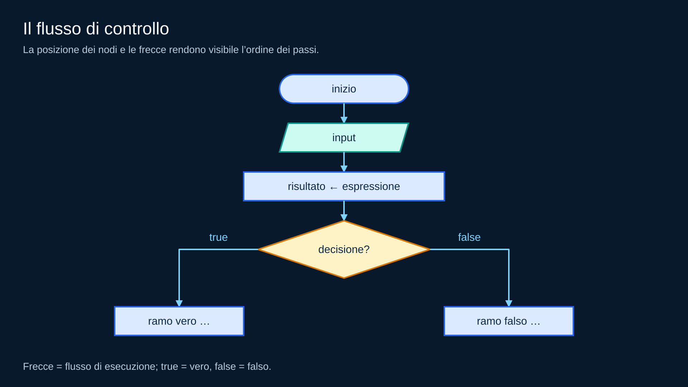</p>
<p align="center"><em>Le frecce indicano il prossimo passo; una decisione sceglie uno dei due rami.</em></p>

<p align="justify"><strong>Pseudocodice dello schema:</strong> dati, calcolo e condizione sono segnaposto da precisare per il problema scelto.</p>

```text
INIZIO
LEGGI dati
ESEGUI calcolo
SE condizione
    ESEGUI passi del ramo vero
ALTRIMENTI
    ESEGUI passi del ramo falso
FINE SE
```

<p align="justify">Non serve a “decorare” l'algoritmo. Serve a mostrare:</p>

<ul>
  <li>che cosa succede prima e dopo;</li>
  <li>dove il flusso si divide;</li>
  <li>dove i rami si ricongiungono;</li>
  <li>se ogni percorso può arrivare a una conclusione.</li>
</ul>

---

## 2. Simboli core del corso

<p align="justify">Usiamo un insieme piccolo e stabile.</p>

<table align="center">
<thead>
<tr>
<th>Idea</th>
<th>Forma convenzionale</th>
<th>Simbolo</th>
<th>Significato</th>
</tr>
</thead>
<tbody>
<tr>
<td>start/end</td>
<td>terminatore</td>
<td align="center">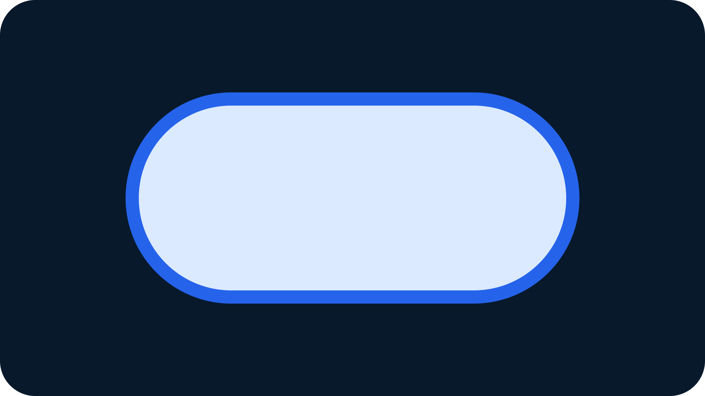</td>
<td>inizio/fine</td>
</tr>
<tr>
<td>input/output</td>
<td>parallelogramma</td>
<td align="center"></td>
<td>dato acquisito o mostrato</td>
</tr>
<tr>
<td>processing</td>
<td>rettangolo</td>
<td align="center"></td>
<td>calcolo/assegnamento</td>
</tr>
<tr>
<td>decision</td>
<td>rombo</td>
<td align="center"></td>
<td>condizione con rami</td>
</tr>
<tr>
<td>freccia</td>
<td>collegamento</td>
<td align="center">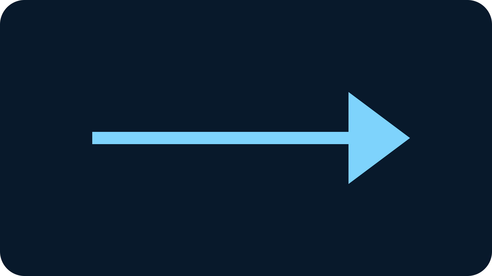</td>
<td>prossimo passo</td>
</tr>
</tbody>
</table>

<p align="justify">La forma grafica aiuta, ma la correttezza dipende soprattutto dal significato dei nodi e dei collegamenti.</p>

---

## 3. Prima sequenza

<p align="justify">Problema:</p>

<blockquote>
<p align="justify">Leggi due numeri e mostra la loro somma.</p>
</blockquote>

<p align="justify">Modello:</p>

<p align="center">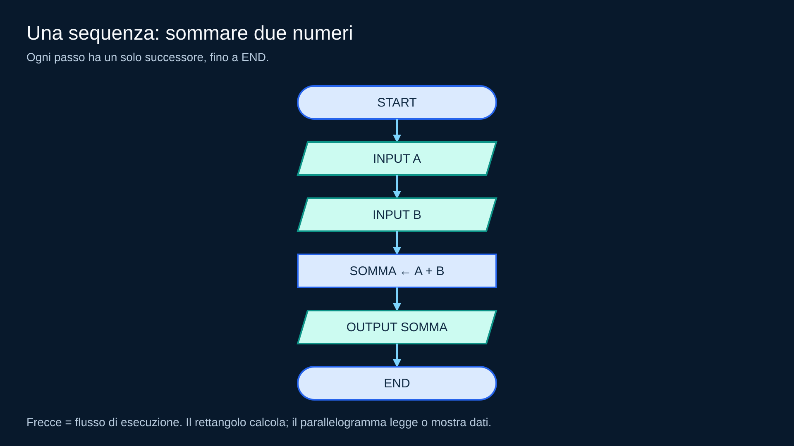</p>
<p align="center"><em>Prima si acquisiscono A e B, poi si calcola la somma e infine la si mostra.</em></p>

<p align="justify"><strong>Pseudocodice:</strong></p>

```text
INIZIO
LEGGI A
LEGGI B
ASSEGNA SOMMA ← A + B
MOSTRA SOMMA
FINE
```

<p align="justify">Ogni passo ha un solo successore.</p>

<table align="center">
<tr>
<td>
<p align="justify">
<strong><span style="font-size: 1.15em;">&#128214;</span> Definizione — sequenza:</strong>
Una sequenza è un insieme di passi eseguiti in ordine, uno dopo l'altro. Ogni passo ha un solo successore, fino alla fine della sequenza.
</p>
</td>
</tr>
</table>

---

## 4. Trace della sequenza

<p align="justify">Con input <code>2</code> e <code>3</code>:</p>

<table align="center">
<thead>
<tr>
<th>nodo</th>
<th>A</th>
<th>B</th>
<th>somma</th>
<th>output</th>
</tr>
</thead>
<tbody>
<tr>
<td>start</td>
<td>—</td>
<td>—</td>
<td>—</td>
<td>—</td>
</tr>
<tr>
<td>input A</td>
<td>2</td>
<td>—</td>
<td>—</td>
<td>—</td>
</tr>
<tr>
<td>input B</td>
<td>2</td>
<td>3</td>
<td>—</td>
<td>—</td>
</tr>
<tr>
<td>calcolo</td>
<td>2</td>
<td>3</td>
<td>5</td>
<td>—</td>
</tr>
<tr>
<td>output</td>
<td>2</td>
<td>3</td>
<td>5</td>
<td>5</td>
</tr>
</tbody>
</table>

<p align="justify">Il diagramma non sostituisce il trace: ci dice <strong>dove andare</strong>, il trace mostra <strong>che cosa succede ai dati</strong>.</p>

---

## 5. La decisione

<p align="justify">Problema:</p>

<blockquote>
<p align="justify">Leggi una temperatura e indica se supera 30.</p>
</blockquote>

<p align="justify">La condizione è:</p>

```text
temperatura > 30 ?
```

<p align="justify">Dal rombo partono due possibilità:</p>

<p align="center">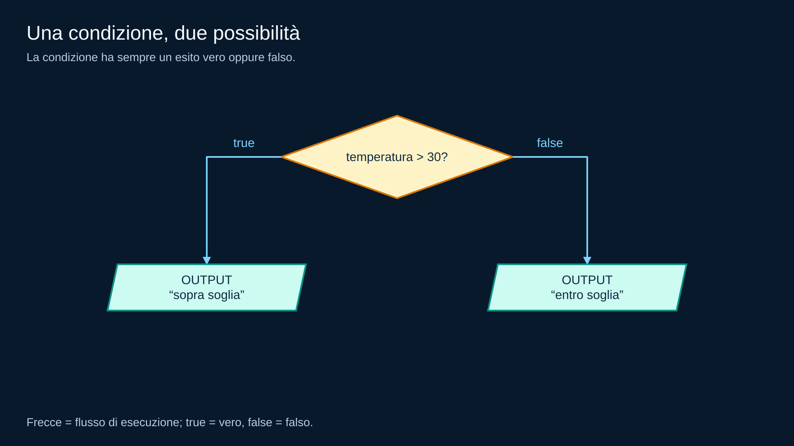</p>
<p align="center"><em>La temperatura 30 segue il ramo false: la soglia non è superata.</em></p>

<p align="justify"><strong>Pseudocodice del frammento:</strong> la temperatura è già stata acquisita.</p>

```text
SE temperatura > 30
    MOSTRA "sopra soglia"
ALTRIMENTI
    MOSTRA "entro soglia"
FINE SE
```

<table align="center">
<tr>
<td>
<p align="justify">
<strong><span style="font-size: 1.15em;">&#128214;</span> Definizione — condizione:</strong>
Una condizione deve poter essere valutata come vera o falsa nel punto in cui viene usata.
</p>
</td>
</tr>
</table>

---

## 6. Selezione doppia

<table align="center">
<tr>
<td>
<p align="justify">
<strong><span style="font-size: 1.15em;">&#128214;</span> Definizione — selezione doppia:</strong>
Una selezione doppia sceglie fra due rami: uno viene eseguito quando la condizione è vera, l'altro quando è falsa.
</p>
</td>
</tr>
</table>

<p align="justify">Nel nostro Flowchart Lab i rami di una decisione sono espliciti:</p>

```text
true
false
```

<p align="justify">Per la soglia:</p>

<p align="center">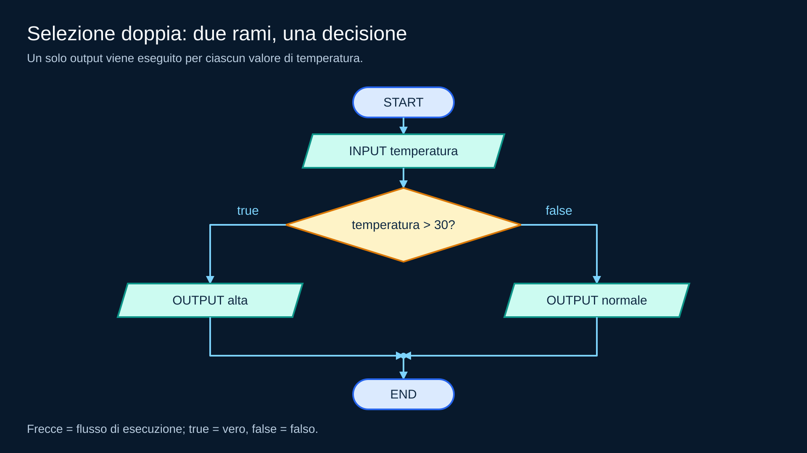</p>
<p align="center"><em>Entrambi i rami arrivano a END; la condizione decide quale output produrre.</em></p>

<p align="justify"><strong>Pseudocodice:</strong></p>

```text
INIZIO
LEGGI temperatura
SE temperatura > 30
    MOSTRA "alta"
ALTRIMENTI
    MOSTRA "normale"
FINE SE
FINE
```

<p align="justify">Domanda importante:</p>

<blockquote>
<p align="justify">Tutti i possibili input seguono uno dei due rami?</p>
</blockquote>

<p align="justify">Per una condizione booleana sì: o è vera o è falsa.</p>

---

## 7. Selezione semplice

<p align="justify">A volte un ramo non richiede un'azione specifica.</p>

<p align="justify">Esempio:</p>

<blockquote>
<p align="justify">Se il saldo è negativo, mostra un avviso; poi continua.</p>
</blockquote>

<p align="center">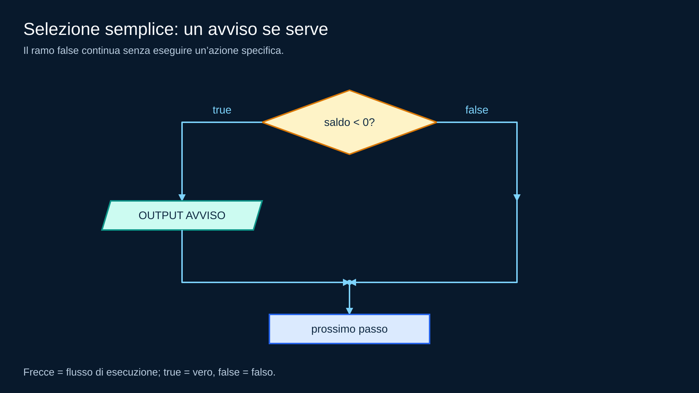</p>
<p align="center"><em>Il ramo false salta l’avviso e si ricongiunge al flusso comune.</em></p>

<p align="justify"><strong>Pseudocodice del frammento:</strong> il saldo è già disponibile. Il prossimo passo si esegue in entrambi i casi.</p>

```text
SE saldo < 0
    MOSTRA "AVVISO"
FINE SE
ESEGUI prossimo passo
```

<p align="justify">Anche quando un ramo “non fa nulla”, il flusso deve restare chiaro.</p>

---

## 8. Condizione invertita

<p align="justify">Specificazione:</p>

<blockquote>
<p align="justify">Mostra “ammesso” se età &gt;= 14.</p>
</blockquote>

<p align="justify">Diagramma sbagliato:</p>

<p align="center">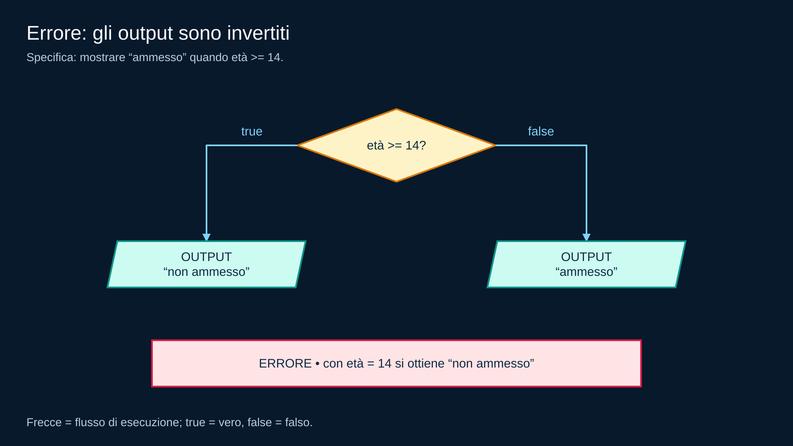</p>
<p align="center"><em>Esempio errato: le frecce sono valide, ma gli output violano la specifica.</em></p>

<p align="justify"><strong>Pseudocodice volutamente errato:</strong> riproduce gli output invertiti del diagramma; l’età è già disponibile.</p>

```text
SE età >= 14
    MOSTRA "non ammesso"
ALTRIMENTI
    MOSTRA "ammesso"
FINE SE
```

<p align="justify">Il diagramma può essere strutturalmente valido ma semanticamente sbagliato.</p>

<p align="justify">Questo è un punto fondamentale:</p>

```text
file/schema valido ≠ algoritmo corretto
```

<p align="justify">Per questo la qualità dell'algoritmo resta evidence/rubric docente.</p>

---

## 9. Output troppo presto

<p align="justify">Problema:</p>

<blockquote>
<p align="justify">Applica uno sconto se il prezzo supera 100, poi mostra il prezzo finale.</p>
</blockquote>

<p align="justify">Errore:</p>

<p align="center">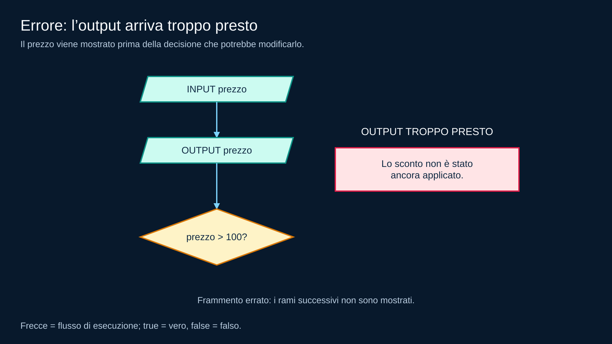</p>
<p align="center"><em>L’ordine sbagliato comunica il prezzo prima di aver stabilito lo sconto.</em></p>

<p align="justify"><strong>Pseudocodice del frammento volutamente errato:</strong> l’output precede la decisione. I puntini indicano i passi successivi, omessi anche nell’immagine.</p>

```text
LEGGI prezzo
MOSTRA prezzo
SE prezzo > 100
    ...
ALTRIMENTI
    ...
FINE SE
```

<p align="justify">Il risultato viene mostrato <strong>prima</strong> della decisione che dovrebbe modificarlo.</p>

<p align="justify">Il trace individua immediatamente il primo punto di divergenza.</p>

---

## 10. Più casi

<p align="justify">Problema:</p>

<blockquote>
<p align="justify">Classifica un valore come negativo, zero o positivo.</p>
</blockquote>

<p align="justify">Possiamo usare due decisioni:</p>

<p align="center">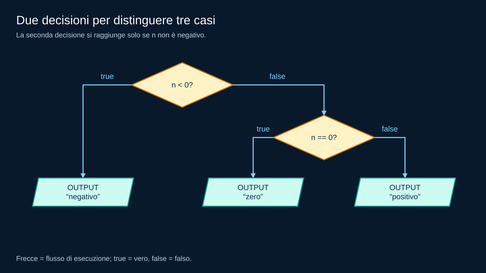</p>
<p align="center"><em>Le due condizioni coprono valori negativi, zero e valori positivi.</em></p>

<p align="justify"><strong>Pseudocodice del frammento:</strong> il valore di <code>n</code> è già disponibile. Il secondo confronto si esegue soltanto quando il primo è falso.</p>

```text
SE n < 0
    MOSTRA "negativo"
ALTRIMENTI
    SE n == 0
        MOSTRA "zero"
    ALTRIMENTI
        MOSTRA "positivo"
    FINE SE
FINE SE
```

<p align="justify">Non abbiamo bisogno di un nuovo simbolo per ogni possibile problema.</p>

<p align="justify">Componiamo poche primitive chiare.</p>

---

## 11. Flowchart Lab: che cosa deve fare per noi

<p align="justify">Quando il runtime managed è disponibile, il percorso è:</p>

<p align="center">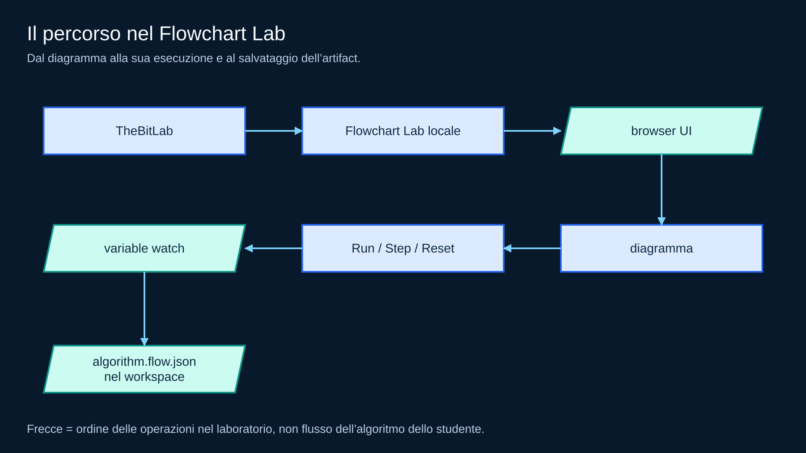</p>
<p align="center"><em>Il laboratorio permette di costruire, eseguire, osservare e salvare il diagramma.</em></p>

<p align="justify">Il browser non esegue Python dello studente.</p>

<p align="justify">Il motore usa un linguaggio di espressioni ristretto e deterministico.</p>

## Importante

<p align="justify">Finché <code>flowchart.lab.v1</code> non è certificata nei profili classroom, il corso mantiene il fallback:</p>

<p align="center">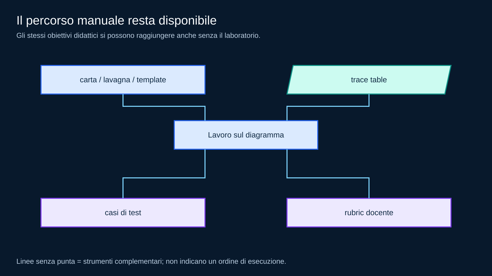</p>
<p align="center"><em>Disegno, trace, test e valutazione docente restano disponibili nel percorso manuale.</em></p>

<p align="justify">Gli outcome didattici non dipendono dalla disponibilità del tool.</p>

---

## 12. Save non significa “consegna perfetta”

<p align="justify">Il Flowchart Lab può verificare cose deterministiche:</p>

<ul>
  <li>schema valido;</li>
  <li>nodi e archi coerenti;</li>
  <li>esecuzione terminata entro il limite;</li>
  <li>output/trace per input dichiarati.</li>
</ul>

<p align="justify">Non può assegnare automaticamente un voto affidabile a:</p>

<ul>
  <li>chiarezza della decomposizione;</li>
  <li>scelta più appropriata dei costrutti;</li>
  <li>semplicità del diagramma;</li>
  <li>qualità della spiegazione.</li>
</ul>

<p align="justify">Questi aspetti restano manuali.</p>

---

## 13. Laboratorio guidato — soglia

<p align="justify">Costruisci il diagramma:</p>

<blockquote>
<p align="justify">Leggi <code>temperatura</code>. Se è maggiore di 30 mostra “sopra soglia”, altrimenti mostra “entro soglia”.</p>
</blockquote>

<p align="justify">Prima di eseguirlo, prepara i test:</p>

```text
31 → sopra soglia
30 → entro soglia
29 → entro soglia
```

<p align="justify">Perché 30 è il caso più importante da non dimenticare?</p>

---

## 14. Controlled Change

<p align="justify">Parti dal diagramma funzionante e cambia soltanto:</p>

<p align="justify">Porta la soglia da <code>30</code> a <code>25</code>.</p>

<p align="justify">Poi aggiorna i casi di test.</p>

<p align="justify">Obiettivo:</p>

<blockquote>
<p align="justify">modificare il requisito senza ridisegnare parti non coinvolte.</p>
</blockquote>

---

## 15. Error Clinic

<p align="justify">Diagnostica uno alla volta:</p>

<ol>
  <li>ramo <code>false</code> mancante;</li>
  <li>condizione invertita;</li>
  <li>output prima dell'assegnamento;</li>
  <li>nodo non raggiungibile;</li>
  <li>ramo che non arriva a <code>end</code>;</li>
  <li>trace atteso diverso dall'esecuzione.</li>
</ol>

<p align="justify">Per ogni errore scrivi:</p>

```text
sintomo
primo nodo problematico
modifica minima
caso che lo rivela
```

---

## Minimum mastery checkpoint

<p align="justify">Dovresti saper:</p>

<ol>
  <li>riconoscere start/end, input/output, processing e decision;</li>
  <li>costruire una sequenza;</li>
  <li>costruire una selezione doppia;</li>
  <li>seguire true/false con un input concreto;</li>
  <li>compilare una trace table;</li>
  <li>progettare almeno un test sul confine;</li>
  <li>distinguere validità strutturale e correttezza semantica;</li>
  <li>usare il fallback manuale senza perdere gli outcome se il tool non è disponibile.</li>
</ol>

## Recap

<p align="center">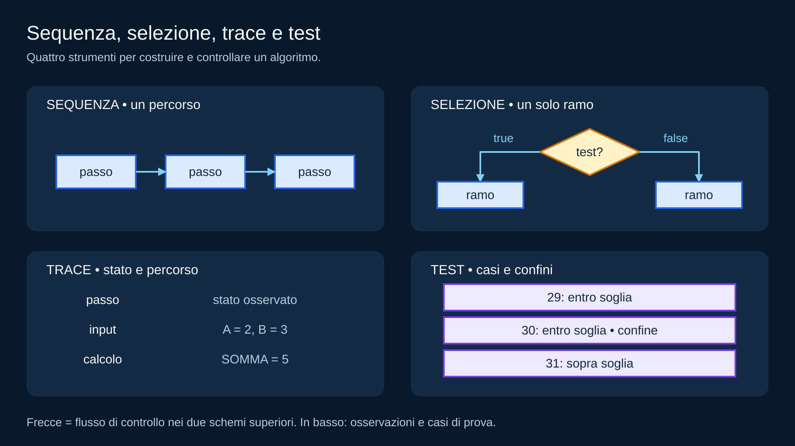</p>
<p align="center"><em>Il diagramma mostra i percorsi; trace e test aiutano a verificarne il comportamento.</em></p>

<p align="justify"><strong>Pseudocodice degli schemi del riepilogo:</strong> nella sequenza i tre passi si eseguono in ordine; nella selezione si esegue uno solo dei due rami.</p>

```text
ESEGUI primo passo
ESEGUI secondo passo
ESEGUI terzo passo
```

```text
SE condizione
    ESEGUI passi del ramo vero
ALTRIMENTI
    ESEGUI passi del ramo falso
FINE SE
```

<p align="justify">Prossimo modulo: introduciamo ripetizione, terminazione e annidamento nei diagrammi.</p>
