# Soluzioni — Laboratorio su selezioni e cicli

[Torna alle consegne](LAB_M02_M03_FLOWCHART.md).

Ogni soluzione comprende un flow chart e il relativo pseudocodice. Gli input rispettano i vincoli delle consegne; l’esercizio 7 gestisce esplicitamente i voti fuori intervallo.

Nei diagrammi un rettangolo può raccogliere assegnamenti consecutivi e un parallelogramma letture consecutive, nell’ordine indicato. I rami `true` e `false` corrispondono a vero e falso. La freccia `←` assegna alla variabile a sinistra il valore dell’espressione a destra.

## Indice

- [1. Spedizione gratuita](#esercizio-1)
- [2. Pari oppure dispari](#esercizio-2)
- [3. Quattro fasce di punteggio](#esercizio-3)
- [4. Biglietto del museo](#esercizio-4)
- [5. Consegna urgente](#esercizio-5)
- [6. Bonus missione](#esercizio-6)
- [7. Un voto valido](#esercizio-7)
- [8. Somma fino allo zero](#esercizio-8)
- [9. I primi N numeri](#esercizio-9)
- [10. N letture, una somma](#esercizio-10)
- [11. Contare i numeri pari](#esercizio-11)
- [12. Avvio facoltativo](#esercizio-12)

---

<a id="esercizio-1"></a>

## 1. Spedizione gratuita

<p align="center">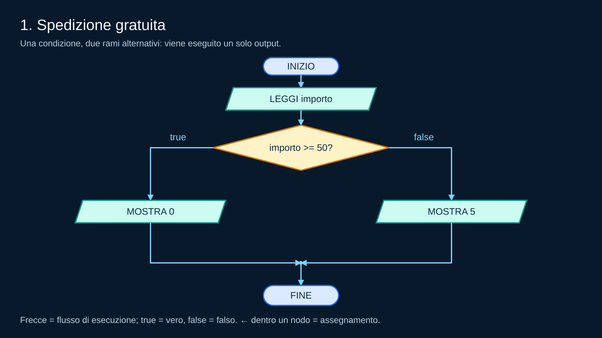</p>
<p align="center"><em>Si legge importo. Se importo &gt;= 50 è vero si mostra 0, altrimenti si mostra 5. I rami si ricongiungono prima della fine.</em></p>

### Pseudocodice

```text
INIZIO
LEGGI importo
SE importo >= 50
    MOSTRA 0
ALTRIMENTI
    MOSTRA 5
FINE SE
FINE
```

**Verifica e spiegazione:** Con importo 49 si mostra 5; con 50 e 51 si mostra 0. La soglia 50 appartiene al ramo vero.

---

<a id="esercizio-2"></a>

## 2. Pari oppure dispari

<p align="center">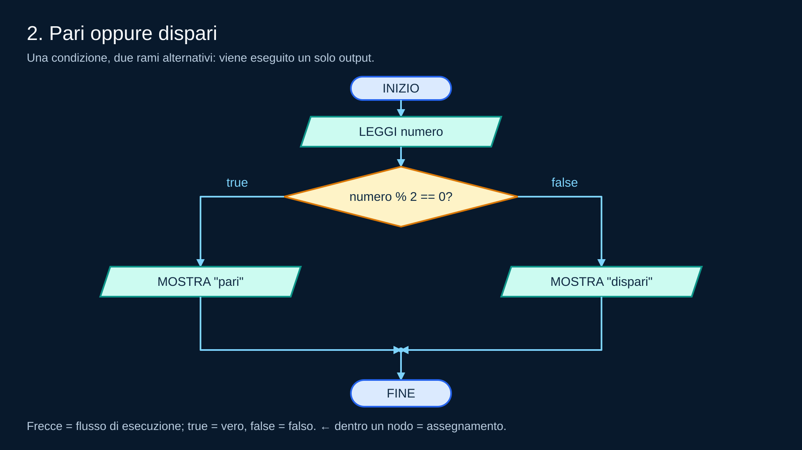</p>
<p align="center"><em>Si legge numero. Se numero % 2 == 0 è vero si mostra &quot;pari&quot;, altrimenti si mostra &quot;dispari&quot;. I rami si ricongiungono prima della fine.</em></p>

### Pseudocodice

```text
INIZIO
LEGGI numero
SE numero % 2 == 0
    MOSTRA "pari"
ALTRIMENTI
    MOSTRA "dispari"
FINE SE
FINE
```

**Verifica e spiegazione:** 0 e 8 producono `pari`; 7 produce `dispari`. Il resto zero identifica anche il numero 0 come pari.

---

<a id="esercizio-3"></a>

## 3. Quattro fasce di punteggio

<p align="center"></p>
<p align="center"><em>Letto punteggio, si controllano in ordine punteggio &gt;= 90, punteggio &gt;= 75, punteggio &gt;= 60. Il primo confronto vero sceglie il proprio output; se sono tutti falsi si esegue il ramo ALTRIMENTI. Un solo output raggiunge FINE.</em></p>

### Pseudocodice

```text
INIZIO
LEGGI punteggio
SE punteggio >= 90
    MOSTRA "ottimo"
ALTRIMENTI SE punteggio >= 75
    MOSTRA "buono"
ALTRIMENTI SE punteggio >= 60
    MOSTRA "sufficiente"
ALTRIMENTI
    MOSTRA "insufficiente"
FINE SE
FINE
```

**Verifica e spiegazione:** 59 → `insufficiente`; 60 e 74 → `sufficiente`; 75 e 89 → `buono`; 90 e 95 → `ottimo`. Con 95, il primo ramo vero salta i due confronti successivi.

---

<a id="esercizio-4"></a>

## 4. Biglietto del museo

<p align="center">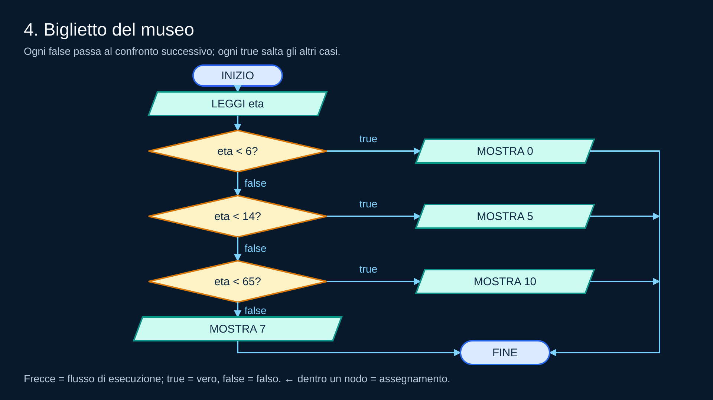</p>
<p align="center"><em>Letto eta, si controllano in ordine eta &lt; 6, eta &lt; 14, eta &lt; 65. Il primo confronto vero sceglie il proprio output; se sono tutti falsi si esegue il ramo ALTRIMENTI. Un solo output raggiunge FINE.</em></p>

### Pseudocodice

```text
INIZIO
LEGGI eta
SE eta < 6
    MOSTRA 0
ALTRIMENTI SE eta < 14
    MOSTRA 5
ALTRIMENTI SE eta < 65
    MOSTRA 10
ALTRIMENTI
    MOSTRA 7
FINE SE
FINE
```

**Verifica e spiegazione:** 5 → 0 euro; 6 e 13 → 5 euro; 14 e 64 → 10 euro; 65 → 7 euro. Le soglie sono controllate in ordine crescente: ogni ramo raccoglie soltanto le età non già gestite.

---

<a id="esercizio-5"></a>

## 5. Consegna urgente

<p align="center">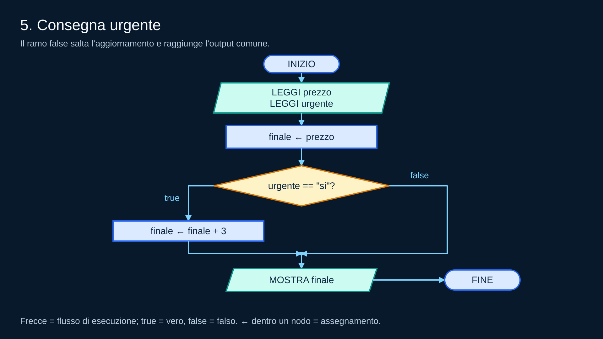</p>
<p align="center"><em>Si leggono prezzo e urgente. Finale parte da prezzo; solo se urgente è si aumenta di 3. Dopo il ricongiungimento si mostra finale.</em></p>

### Pseudocodice

```text
INIZIO
LEGGI prezzo
LEGGI urgente
ASSEGNA finale ← prezzo
SE urgente == "si"
    ASSEGNA finale ← finale + 3
FINE SE
MOSTRA finale
FINE
```

**Verifica e spiegazione:** (12, `no`) → 12; (12, `si`) → 15; (0, `si`) → 3. `finale` è inizializzato prima della decisione, quindi esiste anche quando il ramo vero viene saltato.

---

<a id="esercizio-6"></a>

## 6. Bonus missione

<p align="center">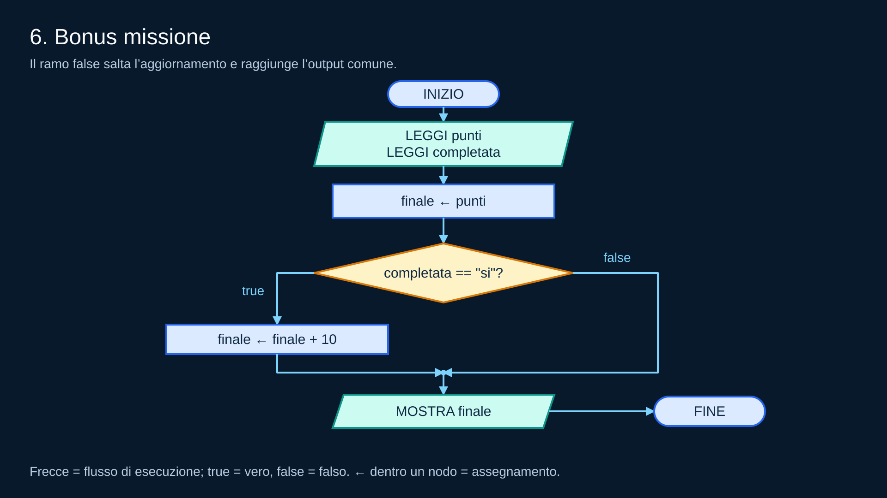</p>
<p align="center"><em>Si leggono punti e completata. Finale parte da punti; solo se completata è si aumenta di 10. Dopo il ricongiungimento si mostra finale.</em></p>

### Pseudocodice

```text
INIZIO
LEGGI punti
LEGGI completata
ASSEGNA finale ← punti
SE completata == "si"
    ASSEGNA finale ← finale + 10
FINE SE
MOSTRA finale
FINE
```

**Verifica e spiegazione:** (20, `no`) → 20; (20, `si`) → 30; (0, `si`) → 10. `MOSTRA finale` è dopo `FINE SE`, così l’output avviene in entrambi i casi.

---

<a id="esercizio-7"></a>

## 7. Un voto valido

<p align="center">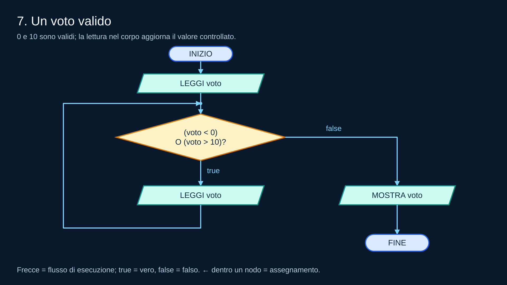</p>
<p align="center"><em>Si legge voto. Finché è minore di 0 o maggiore di 10 si legge di nuovo. Quando è valido si mostra il voto una sola volta e si termina.</em></p>

### Pseudocodice

```text
INIZIO
LEGGI voto
MENTRE (voto < 0) O (voto > 10)
    LEGGI voto
FINE MENTRE
MOSTRA voto
FINE
```

**Verifica e spiegazione:** Con 0 o 10 il corpo non viene eseguito. Con `-1, 11, 7` si effettuano due nuove letture e si mostra solo 7. Se arrivano sempre voti non validi, il ciclo continua: la terminazione dipende dall’arrivo di un voto valido.

---

<a id="esercizio-8"></a>

## 8. Somma fino allo zero

<p align="center">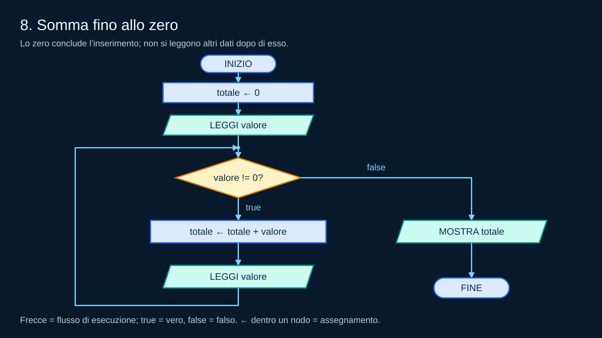</p>
<p align="center"><em>Totale parte da zero. Si legge valore; mentre è diverso da zero si aggiunge a totale e si legge il valore successivo. Lo zero fa uscire verso MOSTRA totale.</em></p>

### Pseudocodice

```text
INIZIO
ASSEGNA totale ← 0
LEGGI valore
MENTRE valore != 0
    ASSEGNA totale ← totale + valore
    LEGGI valore
FINE MENTRE
MOSTRA totale
FINE
```

**Verifica e spiegazione:** `0` → 0; `2, 3, 0` → 5; `4, 1, 2, 0` → 7. Il totale si inizializza una sola volta. La prima lettura precede il test; le successive sono in fondo al corpo. Il ciclo termina quando viene letto zero.

---

<a id="esercizio-9"></a>

## 9. I primi N numeri

<p align="center">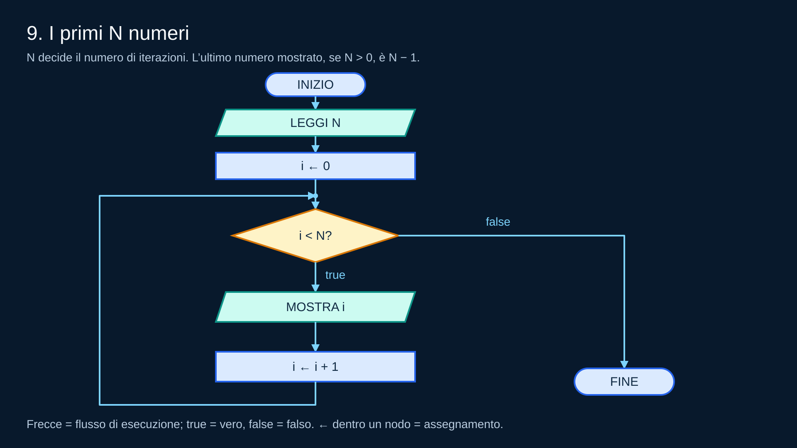</p>
<p align="center"><em>Si legge N e si inizializza i a zero. Mentre i è minore di N si mostra i e si incrementa i. Con N uguale a zero si salta il corpo.</em></p>

### Pseudocodice

```text
INIZIO
LEGGI N
ASSEGNA i ← 0
MENTRE i < N
    MOSTRA i
    ASSEGNA i ← i + 1
FINE MENTRE
FINE
```

**Verifica e spiegazione:** N = 5 → `0, 1, 2, 3, 4`; N = 1 → `0`; N = 0 → nessun output. L’incremento porta i da 0 a N: il controllo finale è falso prima di mostrare N.

---

<a id="esercizio-10"></a>

## 10. N letture, una somma

<p align="center">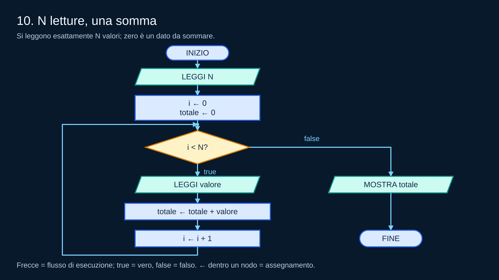</p>
<p align="center"><em>Si legge N; i e totale partono da zero. Mentre i è minore di N si legge un valore, lo si somma a totale e si incrementa i. Dopo il ciclo si mostra totale.</em></p>

### Pseudocodice

```text
INIZIO
LEGGI N
ASSEGNA i ← 0
ASSEGNA totale ← 0
MENTRE i < N
    LEGGI valore
    ASSEGNA totale ← totale + valore
    ASSEGNA i ← i + 1
FINE MENTRE
MOSTRA totale
FINE
```

**Verifica e spiegazione:** N = 4, valori `1, 2, 3, 4` → 10; N = 0 → 0 senza ulteriori letture; N = 3, valori `5, 0, -2` → 3. i conta le letture, totale conserva la somma. Il ciclo termina quando i raggiunge N.

---

<a id="esercizio-11"></a>

## 11. Contare i numeri pari

<p align="center">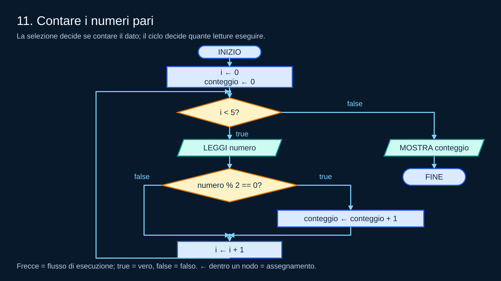</p>
<p align="center"><em>i e conteggio partono da zero. Si leggono cinque numeri; se numero modulo 2 è zero si incrementa conteggio. i aumenta sempre. Dopo cinque letture si mostra conteggio.</em></p>

### Pseudocodice

```text
INIZIO
ASSEGNA i ← 0
ASSEGNA conteggio ← 0
MENTRE i < 5
    LEGGI numero
    SE numero % 2 == 0
        ASSEGNA conteggio ← conteggio + 1
    FINE SE
    ASSEGNA i ← i + 1
FINE MENTRE
MOSTRA conteggio
FINE
```

**Verifica e spiegazione:** `2, 3, 4, 5, 0` → 3; `1, 3, 5, 7, 9` → 0; `0, 2, 4, 6, 8` → 5. i cresce anche per un dispari, quindi ci sono sempre cinque letture. Se i aumentasse solo per i pari, un dispari non conterebbe come lettura e il ciclo potrebbe chiedere più di cinque dati o non terminare.

---

<a id="esercizio-12"></a>

## 12. Avvio facoltativo

<p align="center">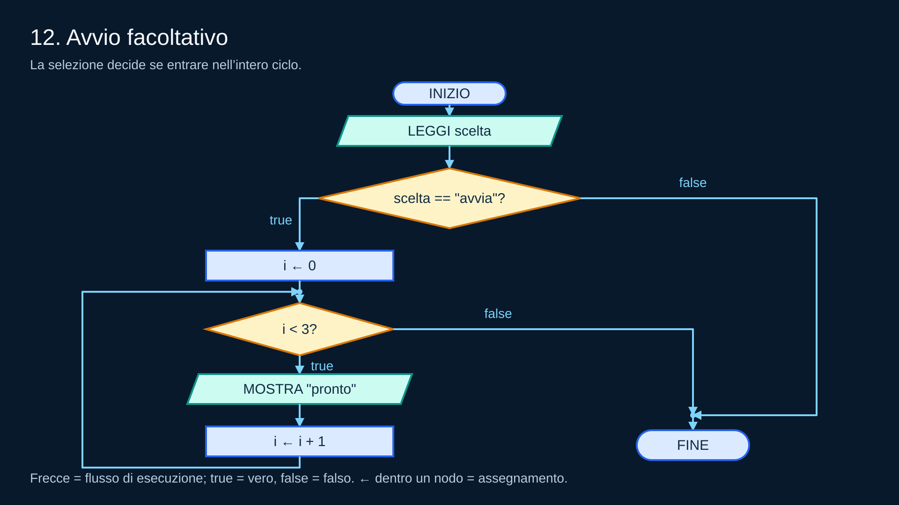</p>
<p align="center"><em>Si legge scelta. Se è avvia si inizializza i e si mostra pronto tre volte incrementando i. Con stop si salta il ciclo e si raggiunge FINE senza output.</em></p>

### Pseudocodice

```text
INIZIO
LEGGI scelta
SE scelta == "avvia"
    ASSEGNA i ← 0
    MENTRE i < 3
        MOSTRA "pronto"
        ASSEGNA i ← i + 1
    FINE MENTRE
FINE SE
FINE
```

**Verifica e spiegazione:** `avvia` → tre messaggi `pronto`; `stop` → nessun output. Nel primo caso i raggiunge 3 e il ciclo termina; nel secondo il flusso salta anche l’inizializzazione di i. Nell’esercizio 11 la selezione era ripetuta per ogni dato, qui viene valutata una sola volta prima del ciclo.
